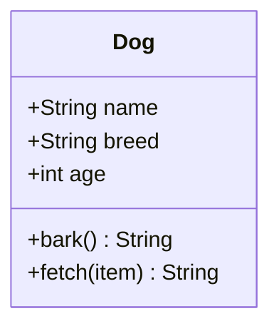
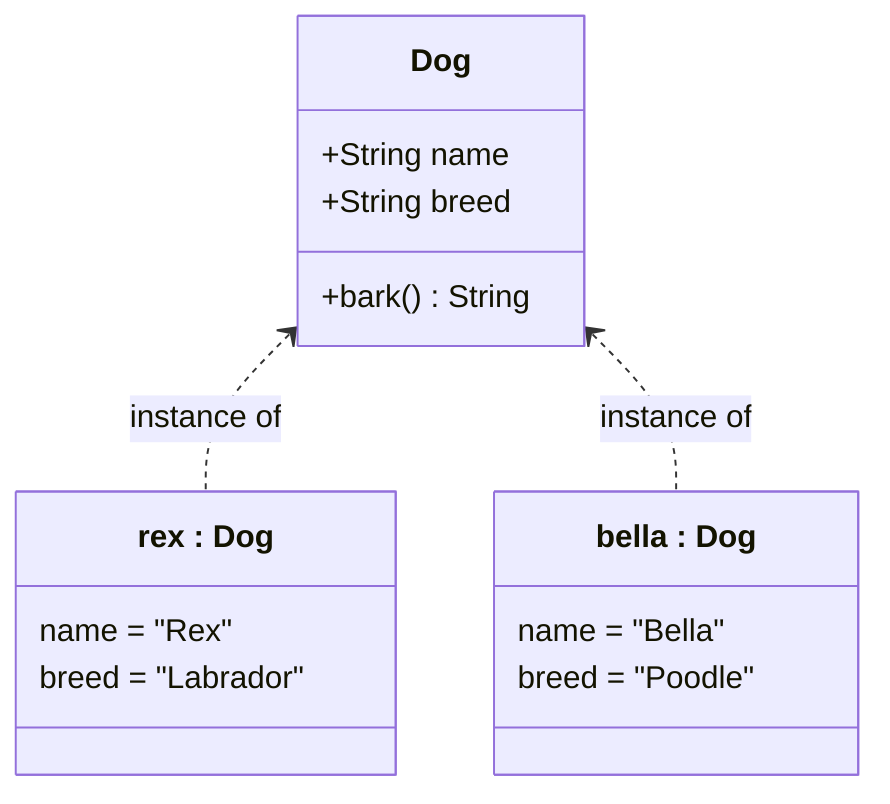
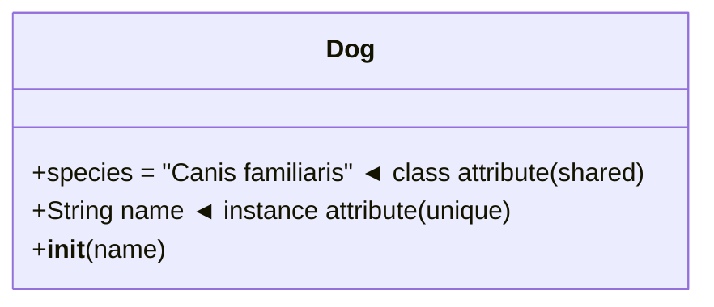
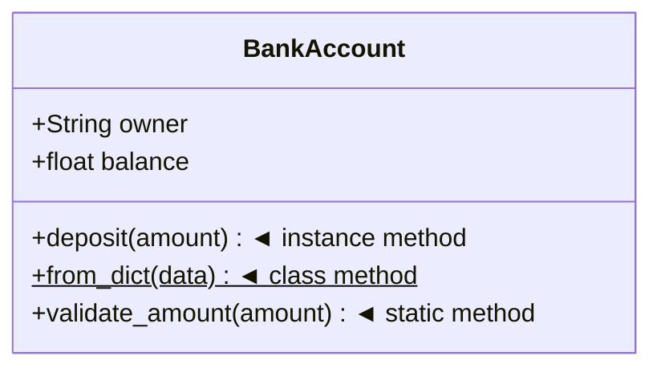
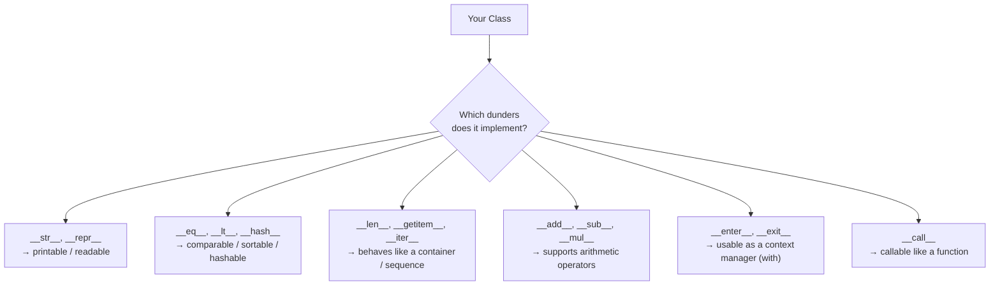

# Introduction to Object-Oriented Programming

## Learning Objectives

By the end of this section, you should be able to:
- Understand what Object-Oriented Programming is and why it exists
- Recognise that Python's built-in types (`str`, `list`, `dict`, …) are already objects
- Define a class and instantiate objects from it
- Distinguish between class attributes and instance attributes
- Understand the different types of methods and when to use each
- Explain what dunder methods are, why they exist, and how they define an object's behaviour
- Read and write basic Python classes with confidence

---

## What is Object-Oriented Programming?

Before OOP, programs were written as long sequences of instructions — one thing after another. As software grew larger, this became impossible to manage.

**Object-Oriented Programming (OOP)** is a way of organising code around *things* (objects) rather than *actions* (procedures). Each object bundles together its own data and the behaviour that operates on that data.

> 💡 Think of it like the real world: a **car** knows its own speed and fuel level, and it knows how to accelerate or brake. You don't reach inside the engine — you use the interface it provides.

OOP has four core benefits:

| Benefit | Description |
|---|---|
| **Modularity** | Code is split into self-contained units that are easy to understand |
| **Reusability** | Classes can be reused across projects or extended via inheritance |
| **Maintainability** | Changes to one class don't ripple unpredictably through the whole codebase |
| **Expressiveness** | Code models real-world concepts, making it easier to reason about |

---

## Classes

A **class** is a blueprint or template. It defines the structure and behaviour that all objects of that type will have — but it is not itself an object.



```python
class Dog:
    pass  # An empty class — valid Python, but not very useful yet
```

Think of a class the same way you would think of an architectural plan for a house. The plan describes how many rooms there are, where the doors go, and how the wiring is laid out — but the plan itself is not a house.

---

## Objects

An **object** (also called an **instance**) is a concrete realisation of a class. You can create as many objects from a class as you need, and each one is independent.



```python
class Dog:
    def __init__(self, name, breed):
        self.name = name
        self.breed = breed

# Creating two independent objects from the same class
rex   = Dog("Rex", "Labrador")
bella = Dog("Bella", "Poodle")

print(rex.name)    # Rex
print(bella.name)  # Bella
```

Continuing the house analogy: `rex` and `bella` are two different houses built from the same plan. Painting one red does not affect the other.

---

## Commonly Used Built-in Objects

You have almost certainly been using objects since your very first line of Python — you just may not have called them that. Every value in Python, whether a number, a string, or a list, is an **object**. Each one is an instance of a built-in class with its own attributes and methods.

> 💡 You can verify this at any time: `type("hello")` returns `<class 'str'>`. Strings are instances of the `str` class.

### Strings (`str`)

A string is an object. It has methods that let you query and transform it without modifying the original (strings are **immutable** — they cannot be changed in place).

```python
greeting = "hello, world"   # an instance of str

print(greeting.upper())                     # "HELLO, WORLD"
print(greeting.capitalize())                # "Hello, world"
print(greeting.replace("world", "Python")) # "hello, Python"
print(greeting.split(", "))                 # ["hello", "world"]
print(greeting.startswith("he"))            # True
```

### Lists (`list`)

A list is a mutable, ordered collection. It is an object with methods for adding, removing, and searching its contents.

```python
fruits = ["banana", "apple", "cherry"]  # an instance of list

fruits.append("mango")       # add to the end
fruits.insert(0, "avocado")  # insert at position 0
fruits.sort()                # sort in-place
fruits.remove("apple")       # remove by value
print(len(fruits))           # 4  — len() works because list defines __len__
```

### Dictionaries (`dict`)

A dictionary maps keys to values. It is an object with methods for accessing, modifying, and iterating over its contents.

```python
patient = {"name": "Alice", "age": 34, "blood_type": "A+"}  # an instance of dict

print(patient.keys())                    # dict_keys(["name", "age", "blood_type"])
print(patient.get("age"))                # 34
print(patient.get("height", "unknown")) # "unknown" — safe default
patient.update({"age": 35})              # update in-place
```

### Other Everyday Objects

| Type | Class | Example |
|---|---|---|
| Whole number | `int` | `42` |
| Decimal number | `float` | `3.14` |
| True / False | `bool` | `True` |
| Ordered, immutable sequence | `tuple` | `(1, 2, 3)` |
| Unique, unordered collection | `set` | `{1, 2, 3}` |
| Key-value mapping | `dict` | `{"a": 1}` |

### Everything is an Object

Because every value is an object, the dot-notation you use to call methods (`greeting.upper()`) is exactly the same mechanism you will use with your own classes:

```python
# Built-in object
name = "alice"
print(name.capitalize())   # Alice

# Your own object
class Patient:
    def __init__(self, name):
        self.name = name

    def greet(self):
        return f"Hello, {self.name.capitalize()}"

p = Patient("alice")
print(p.greet())           # Hello, Alice
```

This uniformity is one of Python's greatest strengths. Learning to write classes is simply learning to create your own types that behave like Python's built-in ones.

---

## The `__init__` Method (Constructor)

`__init__` is a special method that Python calls automatically whenever you create a new object. It is the **constructor** — its job is to set up the initial state of the object.

```python
class Car:
    def __init__(self, brand: str, speed: int = 0):
        #           ↑ self refers to the new object being created
        self.brand = brand   # Set the brand attribute
        self.speed = speed   # Set the speed attribute (defaults to 0)

my_car = Car("Toyota")
print(my_car.brand)  # Toyota
print(my_car.speed)  # 0
```

> ⚠️ `__init__` does **not** create the object — it initialises it. Python's `__new__` creates the object, then `__init__` runs on it. In everyday code you only need to worry about `__init__`.

---

## The `self` Keyword

`self` is a reference to the **current instance** of the class. It is how a method knows which object it is operating on. Python passes it automatically — you never call `my_car.__init__(my_car, "Toyota")` yourself.

```python
class Counter:
    def __init__(self):
        self.count = 0       # 'self' refers to this specific Counter object

    def increment(self):
        self.count += 1      # Modifies THIS object's count, not any other

a = Counter()
b = Counter()

a.increment()
a.increment()

print(a.count)  # 2
print(b.count)  # 0  ← b is unaffected
```

`self` is a **convention**, not a keyword — you could technically call it anything, but you should always use `self`.

---

## Attributes

Attributes are **variables that belong to an object or class**. They store the state (data) of that object.

### Instance Attributes

Instance attributes are unique to each object. They are defined inside methods using `self.attribute_name`.

```python
class Person:
    def __init__(self, name: str, age: int):
        self.name = name   # Each Person has their own name
        self.age  = age    # Each Person has their own age

alice = Person("Alice", 30)
bob   = Person("Bob",   25)

print(alice.name)  # Alice
print(bob.name)    # Bob   ← completely independent
```

### Class Attributes

Class attributes are shared by **all instances** of the class. They are defined directly inside the class body, outside any method.

```python
class Dog:
    species = "Canis familiaris"   # Shared by all Dog instances

    def __init__(self, name: str):
        self.name = name           # Unique to each instance

rex   = Dog("Rex")
bella = Dog("Bella")

print(rex.species)    # Canis familiaris
print(bella.species)  # Canis familiaris  ← same value
print(Dog.species)    # Canis familiaris  ← accessible on the class itself
```



> ⚠️ Be careful with **mutable** class attributes (lists, dicts). All instances share the same object, so modifying it in one place affects all instances.

```python
class Team:
    members = []          # ❌ Shared mutable — a common trap

class Team:
    def __init__(self):
        self.members = [] # ✅ Each instance gets its own list
```

---

## Methods

Methods are **functions defined inside a class**. They define the behaviour of an object. Python has three kinds.



### Instance Methods

The most common type. They receive `self` as the first argument and can read and modify the instance's attributes.

```python
class BankAccount:
    def __init__(self, owner: str, balance: float = 0):
        self.owner   = owner
        self.balance = balance

    def deposit(self, amount: float):
        """Instance method — operates on this specific account."""
        if amount <= 0:
            raise ValueError("Amount must be positive")
        self.balance += amount

    def __str__(self):
        return f"{self.owner}'s account: £{self.balance:.2f}"

account = BankAccount("Alice", 100)
account.deposit(50)
print(account)  # Alice's account: £150.00
```

### Class Methods

Class methods receive the **class itself** (`cls`) as the first argument instead of an instance. They are decorated with `@classmethod` and are commonly used as **alternative constructors**.

```python
class BankAccount:
    def __init__(self, owner: str, balance: float = 0):
        self.owner   = owner
        self.balance = balance

    @classmethod
    def from_dict(cls, data: dict) -> "BankAccount":
        """Alternative constructor — creates an account from a dictionary."""
        return cls(data["owner"], data["balance"])

data    = {"owner": "Bob", "balance": 200}
account = BankAccount.from_dict(data)
print(account.owner)    # Bob
print(account.balance)  # 200
```

### Static Methods

Static methods receive **neither** `self` nor `cls`. They are plain utility functions that happen to live inside the class because they are logically related to it.

```python
class BankAccount:
    def __init__(self, owner: str, balance: float = 0):
        self.owner   = owner
        self.balance = balance

    @staticmethod
    def validate_amount(amount: float) -> bool:
        """Utility — does not need access to the instance or the class."""
        return amount > 0

print(BankAccount.validate_amount(50))   # True
print(BankAccount.validate_amount(-10))  # False
```

### Comparison at a Glance

| Method type | First argument | Access to instance? | Access to class? | Decorator |
|---|---|---|---|---|
| **Instance** | `self` | ✅ Yes | ✅ Via `self.__class__` | *(none)* |
| **Class** | `cls` | ❌ No | ✅ Yes | `@classmethod` |
| **Static** | *(none)* | ❌ No | ❌ No | `@staticmethod` |

---

## Special (Dunder) Methods

### What Are Dunder Methods?

**Dunder methods** (short for *double underscore*) are special methods whose names begin and end with two underscores: `__init__`, `__str__`, `__len__`, and so on. They are also called **magic methods** or **special methods**.

They are the mechanism through which Python lets your classes hook into the language itself. When you write `print(obj)`, Python calls `obj.__str__()`. When you write `len(obj)`, Python calls `obj.__len__()`. When you write `a + b`, Python calls `a.__add__(b)`.

> 💡 You never call dunder methods directly (e.g. `obj.__str__()`). You trigger them *indirectly* through Python syntax and built-in functions. This is by design — it keeps user code clean.

### Why Are They So Important?

Dunder methods are the foundation of Python's **data model** — the set of rules that govern how all objects in the language behave. They are why `str`, `list`, `dict`, and `int` all feel natural and consistent to use.

By implementing dunders in your own classes, you gain three concrete benefits:

| Benefit | What it means in practice |
|---|---|
| **Native integration** | Your objects work with `print()`, `len()`, `sorted()`, `in`, `+`, `==`, `for`, `with`, and every other Python built-in |
| **Expressive code** | Callers can write `record_a == record_b` instead of `record_a.is_equal_to(record_b)` |
| **Duck typing** | Any object that implements the right dunders can be used wherever Python expects a certain kind of object — no inheritance required |

### Before and After: The Difference Dunders Make

Without dunders, your objects are opaque and awkward to work with:

```python
class PatientRecord:
    def __init__(self, patient_id: str, name: str, age: int):
        self.patient_id = patient_id
        self.name       = name
        self.age        = age

record = PatientRecord("P001", "Alice", 34)

# ❌ Printing gives you nothing useful
print(record)          # <__main__.PatientRecord object at 0x7f3a...>

# ❌ Comparing two records is meaningless
r1 = PatientRecord("P001", "Alice", 34)
r2 = PatientRecord("P001", "Alice", 34)
print(r1 == r2)        # False  ← compares memory addresses, not data!
```

With dunders, the same class becomes fluent and Pythonic:

```python
class PatientRecord:
    def __init__(self, patient_id: str, name: str, age: int):
        self.patient_id = patient_id
        self.name       = name
        self.age        = age

    def __str__(self) -> str:
        return f"Patient {self.patient_id}: {self.name}, age {self.age}"

    def __repr__(self) -> str:
        return f"PatientRecord('{self.patient_id}', '{self.name}', {self.age})"

    def __eq__(self, other: object) -> bool:
        if not isinstance(other, PatientRecord):
            return NotImplemented
        return self.patient_id == other.patient_id

    def __lt__(self, other: "PatientRecord") -> bool:
        """Enables sorting by age."""
        return self.age < other.age

    def __hash__(self) -> int:
        """Enables use in sets and as dict keys."""
        return hash(self.patient_id)

r1 = PatientRecord("P001", "Alice", 34)
r2 = PatientRecord("P002", "Bob",   28)
r3 = PatientRecord("P001", "Alice", 34)

# ✅ Readable output
print(r1)              # Patient P001: Alice, age 34

# ✅ Meaningful equality
print(r1 == r3)        # True  ← same patient_id

# ✅ Sortable
records = [r1, r2]
print(sorted(records)) # [Patient P002: Bob, age 28, Patient P001: Alice, age 34]

# ✅ Usable in sets
seen = {r1, r2, r3}
print(len(seen))       # 2  ← r1 and r3 are the same patient
```

### How Dunders Define What an Object *Is*

A Python object is, in a sense, *defined by the dunders it implements*. Different sets of dunders correspond to different **protocols** — informal contracts that say "an object that has these methods can be treated as this kind of thing":



You do not need to inherit from a special base class to satisfy a protocol. If your object has `__len__` and `__getitem__`, Python will treat it as a sequence — full stop. This is **duck typing**: *"If it walks like a duck and quacks like a duck, it is a duck."*

### Dunder Methods by Category

#### Construction & Representation

| Method | Triggered by | Purpose |
|---|---|---|
| `__init__(self, ...)` | `MyClass(...)` | Initialise instance state |
| `__new__(cls, ...)` | `MyClass(...)` | Create the instance (rare to override) |
| `__del__(self)` | Object garbage-collected | Cleanup hook |
| `__str__(self)` | `print(obj)`, `str(obj)` | Human-readable string |
| `__repr__(self)` | REPL, `repr(obj)` | Unambiguous developer string |
| `__format__(self, spec)` | `f"{obj:spec}"` | Custom format spec |

> 💡 Rule of thumb: `__repr__` should ideally be valid Python that recreates the object. `__str__` is for end-user display.

```python
class Medication:
    def __init__(self, name: str, dose_mg: float):
        self.name    = name
        self.dose_mg = dose_mg

    def __str__(self) -> str:
        return f"{self.name} {self.dose_mg}mg"               # for humans

    def __repr__(self) -> str:
        return f"Medication('{self.name}', {self.dose_mg})"  # for developers

    def __format__(self, spec: str) -> str:
        if spec == "short":
            return self.name
        return str(self)

med = Medication("Amoxicillin", 500)
print(med)               # Amoxicillin 500mg
print(repr(med))         # Medication('Amoxicillin', 500)
print(f"{med:short}")    # Amoxicillin
```

#### Comparison & Ordering

Implement these to make your objects comparable with `==`, `<`, `>` etc. and sortable with `sorted()`.

| Method | Triggered by |
|---|---|
| `__eq__(self, other)` | `obj == other` |
| `__ne__(self, other)` | `obj != other` |
| `__lt__(self, other)` | `obj < other` |
| `__le__(self, other)` | `obj <= other` |
| `__gt__(self, other)` | `obj > other` |
| `__ge__(self, other)` | `obj >= other` |
| `__hash__(self)` | `hash(obj)`, use in `set` / `dict` |

> 💡 Use `@functools.total_ordering` to define only `__eq__` and one other (`__lt__` for example) — Python derives the rest automatically.

```python
from functools import total_ordering

@total_ordering
class BloodPressureReading:
    def __init__(self, systolic: int, diastolic: int):
        self.systolic  = systolic
        self.diastolic = diastolic

    def __eq__(self, other: object) -> bool:
        if not isinstance(other, BloodPressureReading):
            return NotImplemented
        return self.systolic == other.systolic and self.diastolic == other.diastolic

    def __lt__(self, other: "BloodPressureReading") -> bool:
        return self.systolic < other.systolic   # sort by systolic pressure

    def __str__(self) -> str:
        return f"{self.systolic}/{self.diastolic} mmHg"

readings = [
    BloodPressureReading(140, 90),
    BloodPressureReading(120, 80),
    BloodPressureReading(160, 95),
]

print(sorted(readings))           # [120/80 mmHg, 140/90 mmHg, 160/95 mmHg]
print(readings[0] > readings[1])  # True
```

#### Container & Sequence Behaviour

Implement these to make your objects behave like lists, dicts, or other collections.

| Method | Triggered by |
|---|---|
| `__len__(self)` | `len(obj)` |
| `__getitem__(self, key)` | `obj[key]` |
| `__setitem__(self, key, val)` | `obj[key] = val` |
| `__delitem__(self, key)` | `del obj[key]` |
| `__contains__(self, item)` | `item in obj` |
| `__iter__(self)` | `for x in obj`, unpacking |
| `__next__(self)` | `next(obj)` |

```python
class Ward:
    """A hospital ward that behaves like a collection of patients."""

    def __init__(self, name: str):
        self.name      = name
        self._patients: list[str] = []

    def admit(self, patient_name: str):
        self._patients.append(patient_name)

    def __len__(self) -> int:
        return len(self._patients)

    def __getitem__(self, index: int) -> str:
        return self._patients[index]

    def __contains__(self, patient_name: str) -> bool:
        return patient_name in self._patients

    def __iter__(self):
        return iter(self._patients)

    def __str__(self) -> str:
        return f"Ward '{self.name}' ({len(self)} patients)"

ward = Ward("Cardiology")
ward.admit("Alice")
ward.admit("Bob")
ward.admit("Carol")

print(ward)          # Ward 'Cardiology' (3 patients)
print(len(ward))     # 3
print(ward[0])       # Alice
print("Bob" in ward) # True

for patient in ward:   # __iter__ makes this work
    print(f"  - {patient}")
```

#### Arithmetic Operators

| Method | Triggered by | Reflected version |
|---|---|---|
| `__add__(self, other)` | `obj + other` | `__radd__` |
| `__sub__(self, other)` | `obj - other` | `__rsub__` |
| `__mul__(self, other)` | `obj * other` | `__rmul__` |
| `__truediv__(self, other)` | `obj / other` | `__rtruediv__` |
| `__iadd__(self, other)` | `obj += other` | — |

#### Context Manager

Implement `__enter__` and `__exit__` to make your object usable with `with`. This guarantees setup and teardown logic even if an exception occurs.

```python
class DatabaseConnection:
    def __init__(self, db_name: str):
        self.db_name   = db_name
        self.connection = None

    def __enter__(self):
        print(f"Opening connection to {self.db_name}")
        self.connection = f"<connection to {self.db_name}>"
        return self                   # bound to the 'as' variable

    def __exit__(self, exc_type, exc_val, exc_tb):
        print(f"Closing connection to {self.db_name}")
        self.connection = None
        return False                  # don't suppress exceptions

with DatabaseConnection("patient_records") as db:
    print(f"Using: {db.connection}")
# Opening connection to patient_records
# Using: <connection to patient_records>
# Closing connection to patient_records  ← always runs, even on exception
```

#### Callable Objects

`__call__` makes an instance callable like a function. This is useful for objects that encapsulate a single primary action or that need to carry configuration alongside their logic.

```python
class DosageCalculator:
    """Callable object that calculates drug dosage by patient weight."""

    def __init__(self, dose_per_kg: float):
        self.dose_per_kg = dose_per_kg

    def __call__(self, weight_kg: float) -> float:
        return self.dose_per_kg * weight_kg

    def __repr__(self) -> str:
        return f"DosageCalculator({self.dose_per_kg}mg/kg)"

amoxicillin_dose = DosageCalculator(dose_per_kg=25)   # 25 mg per kg

print(amoxicillin_dose(60))        # 1500.0  — 60 kg patient
print(amoxicillin_dose(80))        # 2000.0  — 80 kg patient
print(callable(amoxicillin_dose))  # True
```

### Quick Reference

| Category | Methods | Protocol / Enables |
|---|---|---|
| **Construction** | `__init__`, `__new__`, `__del__` | Object lifecycle |
| **Representation** | `__str__`, `__repr__`, `__format__` | `print()`, REPL, f-strings |
| **Comparison** | `__eq__`, `__lt__`, `__hash__` | `==`, sorting, `set`/`dict` keys |
| **Arithmetic** | `__add__`, `__sub__`, `__mul__`, … | `+`, `-`, `*`, `+=`, … |
| **Container** | `__len__`, `__getitem__`, `__iter__`, `__contains__` | `len()`, `[]`, `for`, `in` |
| **Context manager** | `__enter__`, `__exit__` | `with` statement |
| **Callable** | `__call__` | `obj(args)` |
| **Attribute access** | `__getattr__`, `__setattr__`, `__delattr__` | `.` access, `setattr()` |

---

## Putting It All Together

Here is a complete example that uses every concept from this section:

```python
class Product:
    """A retail product — demonstrates classes, objects, attributes, and methods."""

    # Class attribute — shared by all products
    currency = "£"

    def __init__(self, name: str, price: float, stock: int = 0):
        # Instance attributes — unique to each product
        self.name  = name
        self.price = price
        self.stock = stock

    # Instance method — operates on this specific product
    def restock(self, quantity: int):
        if quantity <= 0:
            raise ValueError("Quantity must be positive")
        self.stock += quantity

    def sell(self, quantity: int = 1):
        if quantity > self.stock:
            raise ValueError("Not enough stock")
        self.stock -= quantity
        return self.price * quantity

    # Class method — alternative constructor
    @classmethod
    def from_dict(cls, data: dict) -> "Product":
        return cls(data["name"], data["price"], data.get("stock", 0))

    # Static method — utility, no need for instance or class
    @staticmethod
    def format_price(amount: float, currency: str = "£") -> str:
        return f"{currency}{amount:.2f}"

    # Dunder methods — Python integration
    def __str__(self) -> str:
        return f"{self.name} ({self.currency}{self.price:.2f}) — {self.stock} in stock"

    def __repr__(self) -> str:
        return f"Product(name={self.name!r}, price={self.price}, stock={self.stock})"


# --- Usage ---

# Create objects from the class
apple  = Product("Apple",  0.30, stock=100)
laptop = Product("Laptop", 999.99)

# Use instance methods
laptop.restock(50)
revenue = apple.sell(10)

print(apple)   # Apple (£0.30) — 90 in stock
print(laptop)  # Laptop (£999.99) — 50 in stock
print(f"Revenue: {Product.format_price(revenue)}")  # Revenue: £3.00

# Use class method (alternative constructor)
data    = {"name": "Keyboard", "price": 49.99, "stock": 20}
product = Product.from_dict(data)
print(product)  # Keyboard (£49.99) — 20 in stock
```

---

## Summary

| Concept | What it is | Example |
|---|---|---|
| **Class** | Blueprint / template | `class Dog:` |
| **Object** | Instance of a class | `rex = Dog("Rex")` |
| **`__init__`** | Constructor, sets initial state | `def __init__(self, name):` |
| **`self`** | Reference to the current instance | `self.name = name` |
| **Instance attribute** | Data unique to each object | `self.name` |
| **Class attribute** | Data shared by all objects | `species = "Canis familiaris"` |
| **Instance method** | Behaviour using `self` | `def bark(self):` |
| **Class method** | Behaviour using `cls` | `@classmethod` |
| **Static method** | Utility, no `self` or `cls` | `@staticmethod` |
| **Dunder method** | Python built-in integration | `__str__`, `__add__` |

---

## Next Steps

Now that you understand the building blocks, move on to the four core concepts of OOP:

**[Core Concepts of OOP](./01_core_concepts.md)**

---

[Back to Menu](../README.md) | [Next: Core Concepts](./01_core_concepts.md)

