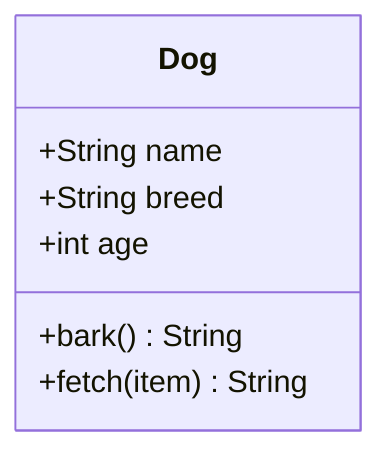
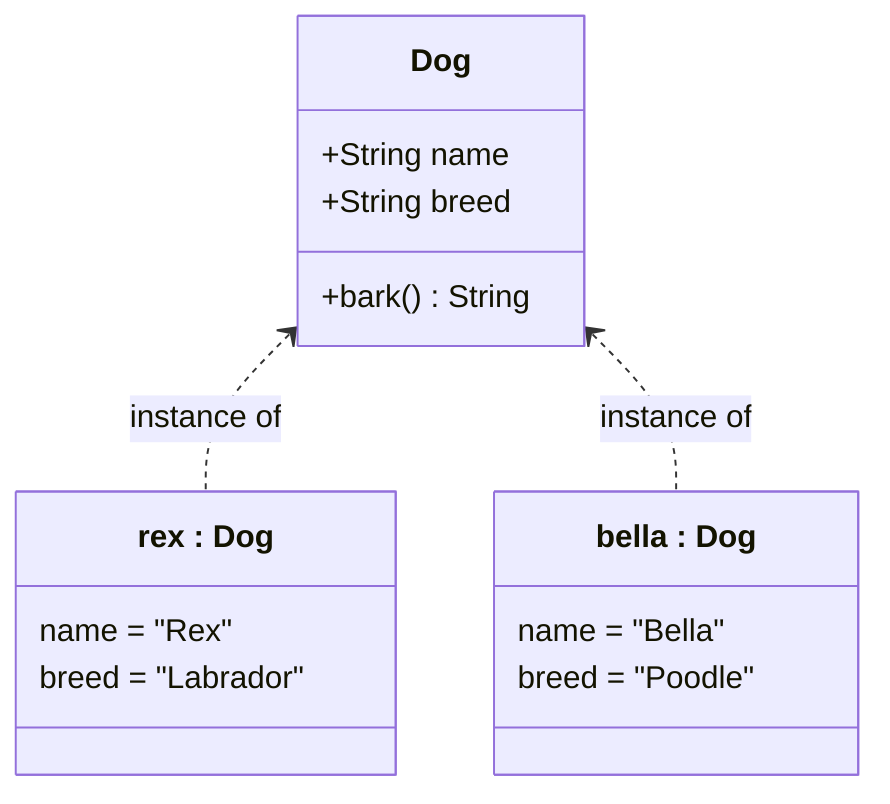
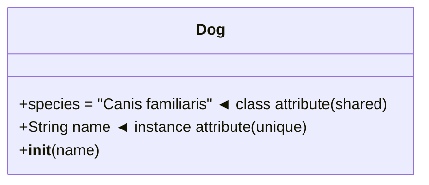
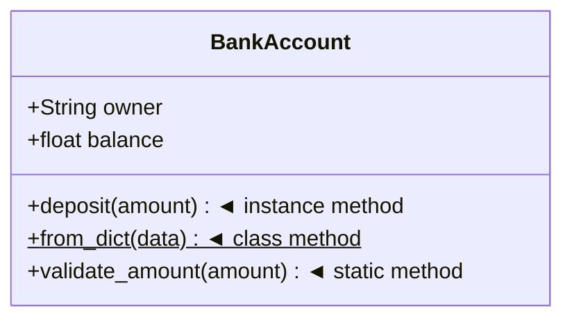

# Introduction to Object-Oriented Programming

## Learning Objectives

By the end of this section, you should be able to:
- Understand what Object-Oriented Programming is and why it exists
- Define a class and instantiate objects from it
- Distinguish between class attributes and instance attributes
- Understand the different types of methods and when to use each
- Read and write basic Python classes with confidence

---

## What is Object-Oriented Programming?

Before OOP, programs were written as long sequences of instructions — one thing after another. As software grew larger, this became impossible to manage.

**Object-Oriented Programming (OOP)** is a way of organising code around *things* (objects) rather than *actions* (procedures). Each object bundles together its own data and the behaviour that operates on that data.

> 💡 Think of it like the real world: a **car** knows its own speed and fuel level, and it knows how to accelerate or brake. You don't reach inside the engine — you use the interface it provides.

OOP has four core benefits:

| Benefit | Description |
|---|---|
| **Modularity** | Code is split into self-contained units that are easy to understand |
| **Reusability** | Classes can be reused across projects or extended via inheritance |
| **Maintainability** | Changes to one class don't ripple unpredictably through the whole codebase |
| **Expressiveness** | Code models real-world concepts, making it easier to reason about |

---

## Classes

A **class** is a blueprint or template. It defines the structure and behaviour that all objects of that type will have — but it is not itself an object.



```python
class Dog:
    pass  # An empty class — valid Python, but not very useful yet
```

Think of a class the same way you would think of an architectural plan for a house. The plan describes how many rooms there are, where the doors go, and how the wiring is laid out — but the plan itself is not a house.

---

## Objects

An **object** (also called an **instance**) is a concrete realisation of a class. You can create as many objects from a class as you need, and each one is independent.



```python
class Dog:
    def __init__(self, name, breed):
        self.name = name
        self.breed = breed

# Creating two independent objects from the same class
rex   = Dog("Rex", "Labrador")
bella = Dog("Bella", "Poodle")

print(rex.name)    # Rex
print(bella.name)  # Bella
```

Continuing the house analogy: `rex` and `bella` are two different houses built from the same plan. Painting one red does not affect the other.

---

## The `__init__` Method (Constructor)

`__init__` is a special method that Python calls automatically whenever you create a new object. It is the **constructor** — its job is to set up the initial state of the object.

```python
class Car:
    def __init__(self, brand: str, speed: int = 0):
        #           ↑ self refers to the new object being created
        self.brand = brand   # Set the brand attribute
        self.speed = speed   # Set the speed attribute (defaults to 0)

my_car = Car("Toyota")
print(my_car.brand)  # Toyota
print(my_car.speed)  # 0
```

> ⚠️ `__init__` does **not** create the object — it initialises it. Python's `__new__` creates the object, then `__init__` runs on it. In everyday code you only need to worry about `__init__`.

---

## The `self` Keyword

`self` is a reference to the **current instance** of the class. It is how a method knows which object it is operating on. Python passes it automatically — you never call `my_car.__init__(my_car, "Toyota")` yourself.

```python
class Counter:
    def __init__(self):
        self.count = 0       # 'self' refers to this specific Counter object

    def increment(self):
        self.count += 1      # Modifies THIS object's count, not any other

a = Counter()
b = Counter()

a.increment()
a.increment()

print(a.count)  # 2
print(b.count)  # 0  ← b is unaffected
```

`self` is a **convention**, not a keyword — you could technically call it anything, but you should always use `self`.

---

## Attributes

Attributes are **variables that belong to an object or class**. They store the state (data) of that object.

### Instance Attributes

Instance attributes are unique to each object. They are defined inside methods using `self.attribute_name`.

```python
class Person:
    def __init__(self, name: str, age: int):
        self.name = name   # Each Person has their own name
        self.age  = age    # Each Person has their own age

alice = Person("Alice", 30)
bob   = Person("Bob",   25)

print(alice.name)  # Alice
print(bob.name)    # Bob   ← completely independent
```

### Class Attributes

Class attributes are shared by **all instances** of the class. They are defined directly inside the class body, outside any method.

```python
class Dog:
    species = "Canis familiaris"   # Shared by all Dog instances

    def __init__(self, name: str):
        self.name = name           # Unique to each instance

rex   = Dog("Rex")
bella = Dog("Bella")

print(rex.species)    # Canis familiaris
print(bella.species)  # Canis familiaris  ← same value
print(Dog.species)    # Canis familiaris  ← accessible on the class itself
```



> ⚠️ Be careful with **mutable** class attributes (lists, dicts). All instances share the same object, so modifying it in one place affects all instances.

```python
class Team:
    members = []          # ❌ Shared mutable — a common trap

class Team:
    def __init__(self):
        self.members = [] # ✅ Each instance gets its own list
```

---

## Methods

Methods are **functions defined inside a class**. They define the behaviour of an object. Python has three kinds.



### Instance Methods

The most common type. They receive `self` as the first argument and can read and modify the instance's attributes.

```python
class BankAccount:
    def __init__(self, owner: str, balance: float = 0):
        self.owner   = owner
        self.balance = balance

    def deposit(self, amount: float):
        """Instance method — operates on this specific account."""
        if amount <= 0:
            raise ValueError("Amount must be positive")
        self.balance += amount

    def __str__(self):
        return f"{self.owner}'s account: £{self.balance:.2f}"

account = BankAccount("Alice", 100)
account.deposit(50)
print(account)  # Alice's account: £150.00
```

### Class Methods

Class methods receive the **class itself** (`cls`) as the first argument instead of an instance. They are decorated with `@classmethod` and are commonly used as **alternative constructors**.

```python
class BankAccount:
    def __init__(self, owner: str, balance: float = 0):
        self.owner   = owner
        self.balance = balance

    @classmethod
    def from_dict(cls, data: dict) -> "BankAccount":
        """Alternative constructor — creates an account from a dictionary."""
        return cls(data["owner"], data["balance"])

data    = {"owner": "Bob", "balance": 200}
account = BankAccount.from_dict(data)
print(account.owner)    # Bob
print(account.balance)  # 200
```

### Static Methods

Static methods receive **neither** `self` nor `cls`. They are plain utility functions that happen to live inside the class because they are logically related to it.

```python
class BankAccount:
    def __init__(self, owner: str, balance: float = 0):
        self.owner   = owner
        self.balance = balance

    @staticmethod
    def validate_amount(amount: float) -> bool:
        """Utility — does not need access to the instance or the class."""
        return amount > 0

print(BankAccount.validate_amount(50))   # True
print(BankAccount.validate_amount(-10))  # False
```

### Comparison at a Glance

| Method type | First argument | Access to instance? | Access to class? | Decorator |
|---|---|---|---|---|
| **Instance** | `self` | ✅ Yes | ✅ Via `self.__class__` | *(none)* |
| **Class** | `cls` | ❌ No | ✅ Yes | `@classmethod` |
| **Static** | *(none)* | ❌ No | ❌ No | `@staticmethod` |

---

## Special (Dunder) Methods

Python classes can implement **special methods** (also called *dunder* methods, short for "double underscore") to integrate with built-in Python behaviour.

```python
class Vector:
    def __init__(self, x: float, y: float):
        self.x = x
        self.y = y

    def __str__(self) -> str:
        """Called by print() and str()."""
        return f"Vector({self.x}, {self.y})"

    def __repr__(self) -> str:
        """Called in the REPL and by repr()."""
        return f"Vector(x={self.x}, y={self.y})"

    def __add__(self, other: "Vector") -> "Vector":
        """Called when using the + operator."""
        return Vector(self.x + other.x, self.y + other.y)

    def __eq__(self, other: "Vector") -> bool:
        """Called when using the == operator."""
        return self.x == other.x and self.y == other.y

    def __len__(self) -> int:
        """Called by len()."""
        return 2  # A 2D vector always has 2 components


v1 = Vector(1, 2)
v2 = Vector(3, 4)

print(v1)          # Vector(1, 2)
print(v1 + v2)     # Vector(4, 6)
print(v1 == v2)    # False
print(len(v1))     # 2
```

Common dunder methods you'll encounter:

| Method | Triggered by |
|---|---|
| `__init__` | `MyClass()` — object construction |
| `__str__` | `print(obj)`, `str(obj)` |
| `__repr__` | REPL display, `repr(obj)` |
| `__len__` | `len(obj)` |
| `__add__` | `obj + other` |
| `__eq__` | `obj == other` |
| `__lt__` | `obj < other` |
| `__getitem__` | `obj[key]` |
| `__iter__` | `for item in obj` |
| `__enter__` / `__exit__` | `with obj:` |

---

## Putting It All Together

Here is a complete example that uses every concept from this section:

```python
class Product:
    """A retail product — demonstrates classes, objects, attributes, and methods."""

    # Class attribute — shared by all products
    currency = "£"

    def __init__(self, name: str, price: float, stock: int = 0):
        # Instance attributes — unique to each product
        self.name  = name
        self.price = price
        self.stock = stock

    # Instance method — operates on this specific product
    def restock(self, quantity: int):
        if quantity <= 0:
            raise ValueError("Quantity must be positive")
        self.stock += quantity

    def sell(self, quantity: int = 1):
        if quantity > self.stock:
            raise ValueError("Not enough stock")
        self.stock -= quantity
        return self.price * quantity

    # Class method — alternative constructor
    @classmethod
    def from_dict(cls, data: dict) -> "Product":
        return cls(data["name"], data["price"], data.get("stock", 0))

    # Static method — utility, no need for instance or class
    @staticmethod
    def format_price(amount: float, currency: str = "£") -> str:
        return f"{currency}{amount:.2f}"

    # Dunder methods — Python integration
    def __str__(self) -> str:
        return f"{self.name} ({self.currency}{self.price:.2f}) — {self.stock} in stock"

    def __repr__(self) -> str:
        return f"Product(name={self.name!r}, price={self.price}, stock={self.stock})"


# --- Usage ---

# Create objects from the class
apple  = Product("Apple",  0.30, stock=100)
laptop = Product("Laptop", 999.99)

# Use instance methods
laptop.restock(50)
revenue = apple.sell(10)

print(apple)   # Apple (£0.30) — 90 in stock
print(laptop)  # Laptop (£999.99) — 50 in stock
print(f"Revenue: {Product.format_price(revenue)}")  # Revenue: £3.00

# Use class method (alternative constructor)
data    = {"name": "Keyboard", "price": 49.99, "stock": 20}
product = Product.from_dict(data)
print(product)  # Keyboard (£49.99) — 20 in stock
```

---

## Summary

| Concept | What it is | Example |
|---|---|---|
| **Class** | Blueprint / template | `class Dog:` |
| **Object** | Instance of a class | `rex = Dog("Rex")` |
| **`__init__`** | Constructor, sets initial state | `def __init__(self, name):` |
| **`self`** | Reference to the current instance | `self.name = name` |
| **Instance attribute** | Data unique to each object | `self.name` |
| **Class attribute** | Data shared by all objects | `species = "Canis familiaris"` |
| **Instance method** | Behaviour using `self` | `def bark(self):` |
| **Class method** | Behaviour using `cls` | `@classmethod` |
| **Static method** | Utility, no `self` or `cls` | `@staticmethod` |
| **Dunder method** | Python built-in integration | `__str__`, `__add__` |

---

## Next Steps

Now that you understand the building blocks, move on to the four core concepts of OOP:

**[Core Concepts of OOP](./01_core_concepts.md)**

