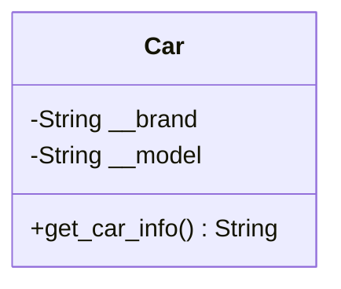
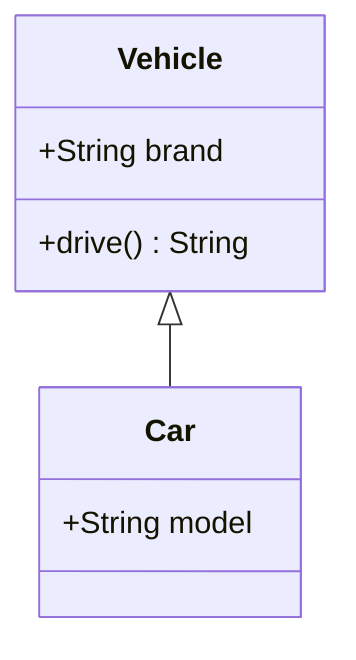
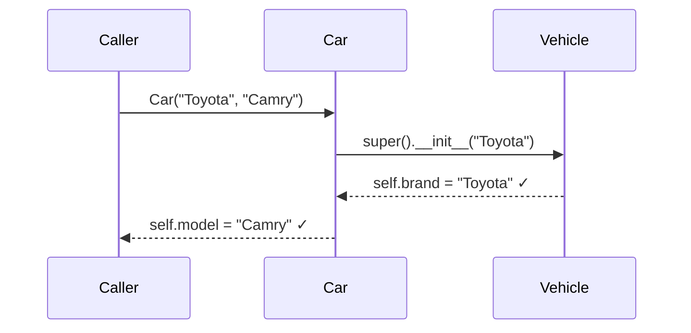
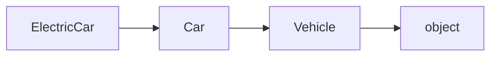
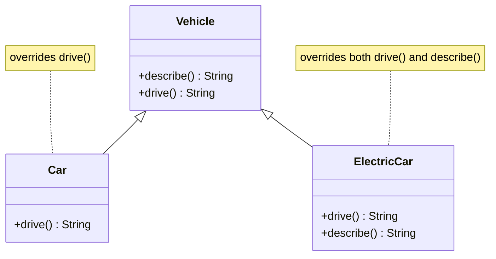
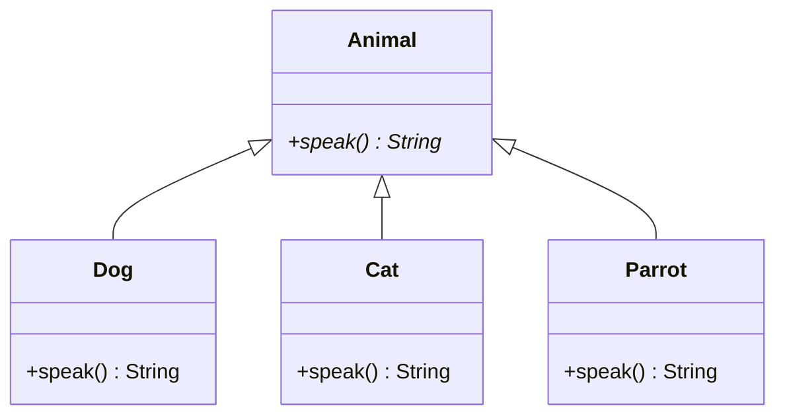
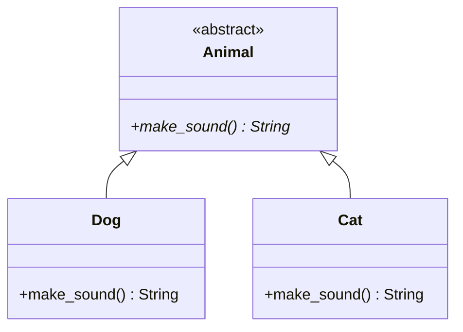
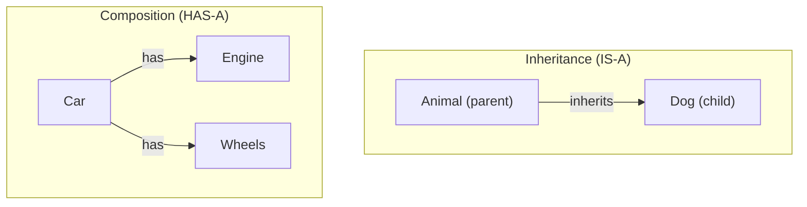

# Core Concepts of OOP

## Learning Objectives

By the end of this section, you should be able to:
- Understand and implement encapsulation to protect data integrity
- Create class hierarchies using inheritance to promote code reuse
- Apply polymorphism to write flexible, interchangeable code
- Use abstraction to hide complexity and expose clean interfaces
- Design flexible systems using composition over inheritance

---

## 1. Encapsulation
Encapsulation is the practice of bundling data (variables) and methods that operate on the data into a single unit, usually a class. It restricts direct access to some components and protects the integrity of the object.



```python
class Car:
    def __init__(self, brand, model):
        self.__brand = brand  # Name-mangled (harder to access, not truly private)
        self.__model = model  # Name-mangled (harder to access, not truly private)

    def get_car_info(self):
        return f"{self.__brand} {self.__model}"

car = Car("Toyota", "Corolla")
print(car.get_car_info())  # Toyota Corolla
```

### ⚠️ Python's Accessibility Levels — There is No True "Private"

Unlike Java or C++, Python has **no enforcement** of privacy. Instead, it uses conventions and a mechanism called **name mangling**. Understand the distinction:

| Style | Name | Accessibility | Use case |
|---|---|---|---|
| `name` | Public | ✅ Accessible from anywhere | Part of the public API; intended for external use |
| `_name` | Protected | ✅ Technically accessible, but convention says "don't use" | Internal implementation detail; hint that it may change |
| `__name` | Name-mangled | ✅ Still accessible via `_ClassName__name`, but discouraged | Prevent accidental name collisions in subclasses (not for security) |

**Name mangling** — what actually happens with `__`:

```python
class Car:
    def __init__(self):
        self.__brand = "Toyota"  # becomes self._Car__brand internally

car = Car()

# ❌ This fails (no attribute named __brand):
# print(car.__brand)  → AttributeError

# ✅ But this works (name mangling is transparent to the class):
print(car._Car__brand)  # Toyota — you can still access it if you know the trick

# ✅ Even simpler: modify it directly
car._Car__brand = "Honda"
print(car._Car__brand)  # Honda
```

**The Python philosophy**: "We're all consenting adults here." Python trusts developers not to break encapsulation by convention, rather than preventing it by force.

#### Best Practice: Use `_single_underscore` for encapsulation

In practice, Python developers rarely use `__double_underscore`. Use `_single_underscore` instead — it's clearer and achieves the goal: signal "this is internal" while remaining straightforward.

```python
# ✅ Better: signals "internal" via convention, no name mangling confusion
class Car:
    def __init__(self, brand, model):
        self._brand = brand   # Protected — internal, don't access directly
        self._model = model

    def get_car_info(self):
        return f"{self._brand} {self._model}"

    @property
    def brand(self):
        """Public property for read-only access."""
        return self._brand
```

Why prefer `_single_underscore`?
- It's explicit without hiding the actual name
- Subclasses can access it without name mangling gymnastics
- Most of the Python ecosystem uses this convention
- Easier to debug and document

## 2. Inheritance
Inheritance allows a class (child) to inherit attributes and methods from another class (parent), promoting code reusability.



### The IS-A Relationship

Inheritance models **"IS-A"** relationships — when a child class represents a more specific type of the parent class. A Dog *is-a* type of Animal. An ElectricCar *is-a* type of Vehicle. The child class inherits all the parent's behaviour and data, but can add or override specifics.

```python
class Animal:
    def eat(self):
        return "Eating..."

class Dog(Animal):
    """A Dog IS-A Animal — it inherits eat() and adds new behavior."""
    def bark(self):
        return "Woof!"

dog = Dog()
print(dog.eat())   # Inherited from Animal
print(dog.bark())  # Specific to Dog
```

**Key principle**: Use inheritance when the relationship is stable and captures a fundamental truth about the types. A Penguin IS-A Bird. A SavingsAccount IS-A BankAccount. But a Person and a Doctor — that's not an IS-A relationship (a person *has* a job, not *is* a job) — that's better modelled with composition (see [Section 5: Composition](#5-composition)).

---

```python
class Vehicle:
    def __init__(self, brand):
        self.brand = brand
    
    def drive(self):
        return "Driving..."

class Car(Vehicle):
    def __init__(self, brand, model):
        super().__init__(brand)
        self.model = model

car = Car("Toyota", "Camry")
print(car.brand)  # Toyota
print(car.drive())  # Driving...
```

### The `super()` Keyword

`super()` returns a **proxy object** that delegates method calls to the **parent class** (or the next class in the MRO — see below). It is the correct, safe way to call a parent's methods from a child class.

> 💡 Never hardcode the parent class name (`Vehicle.__init__(self, brand)`) — always use `super()`. This keeps the code correct even when the inheritance hierarchy changes.

#### Why `super()` exists

Without `super()`, calling a parent method means hardcoding the parent's name:

```python
class Car(Vehicle):
    def __init__(self, brand, model):
        Vehicle.__init__(self, brand)  # ❌ Fragile — breaks if the parent is renamed
        self.model = model             #    or if multiple inheritance is introduced
```

With `super()`, the resolution is automatic:

```python
class Car(Vehicle):
    def __init__(self, brand, model):
        super().__init__(brand)  # ✅ Always calls the right parent, regardless of hierarchy
        self.model = model
```

#### Using `super()` in `__init__` — Constructor Chaining

The most common use of `super()` is in `__init__` to ensure the parent class is properly initialised before the child adds its own attributes:



```python
class Vehicle:
    def __init__(self, brand: str, year: int):
        self.brand = brand
        self.year  = year
        print(f"Vehicle.__init__: brand={brand}, year={year}")

class Car(Vehicle):
    def __init__(self, brand: str, year: int, model: str):
        super().__init__(brand, year)  # ← parent sets self.brand and self.year first
        self.model = model             # ← child adds its own attribute after
        print(f"Car.__init__: model={model}")

class ElectricCar(Car):
    def __init__(self, brand: str, year: int, model: str, range_km: int):
        super().__init__(brand, year, model)  # ← chains up through Car → Vehicle
        self.range_km = range_km
        print(f"ElectricCar.__init__: range_km={range_km}")

ev = ElectricCar("Tesla", 2024, "Model 3", 500)
# Vehicle.__init__: brand=Tesla, year=2024
# Car.__init__: model=Model 3
# ElectricCar.__init__: range_km=500

print(ev.brand)     # Tesla    ← set by Vehicle
print(ev.model)     # Model 3  ← set by Car
print(ev.range_km)  # 500      ← set by ElectricCar
```

> ⚠️ Forgetting `super().__init__()` in a child class means the parent's attributes are never set — you will get `AttributeError` the first time you access them.

```python
class BrokenCar(Vehicle):
    def __init__(self, brand, model):
        # super().__init__ NOT called — self.brand and self.year are never set
        self.model = model

bc = BrokenCar("Toyota", "Camry")
print(bc.model)   # Camry      ← fine
print(bc.brand)   # ❌ AttributeError: 'BrokenCar' object has no attribute 'brand'
```

#### Using `super()` in regular methods — Extending, not replacing

`super()` is not limited to `__init__`. You can use it in any method to call the parent's version and then *extend* it:

```python
class Vehicle:
    def describe(self) -> str:
        return f"{self.brand} ({self.year})"

class ElectricCar(Car):
    def describe(self) -> str:
        base = super().describe()          # ← get the parent's description first
        return f"{base} — electric, {self.range_km}km range"

ev = ElectricCar("Tesla", 2024, "Model 3", 500)
print(ev.describe())  # Tesla (2024) — electric, 500km range
```

This is the key principle: use `super()` to **extend** parent behaviour, not silently replace it.

#### Method Resolution Order (MRO)

When Python looks up a method or attribute, it follows a specific search order called the **Method Resolution Order (MRO)**. You can inspect it with `ClassName.__mro__` or `help(ClassName)`:

```python
print(ElectricCar.__mro__)
# (<class 'ElectricCar'>, <class 'Car'>, <class 'Vehicle'>, <class 'object'>)
```



`super()` always calls the **next class in the MRO**, not necessarily the direct parent. This matters with multiple inheritance (covered in [Mixin Pattern](./04_design_patterns.md#7-mixin-pattern-structural)) — but in simple single-inheritance chains it is always just the direct parent.

---

### Method Overriding

**Method overriding** is when a child class provides its own implementation of a method that already exists in the parent class. Python will always use the most specific (lowest) version in the hierarchy.



```python
class Vehicle:
    def drive(self):
        return "Driving..."

    def describe(self):
        return "I am a vehicle"


class Car(Vehicle):
    # Overrides drive() — replaces the parent version entirely
    def drive(self):
        return "Driving on roads"
    # describe() is NOT overridden — inherited as-is from Vehicle


class ElectricCar(Vehicle):
    # Overrides drive() with a different implementation
    def drive(self):
        return "Driving silently on electricity"

    # Overrides describe() and calls the parent version via super()
    def describe(self):
        base = super().describe()   # ← calls Vehicle.describe()
        return f"{base}, specifically an electric vehicle"


car = Car()
ev = ElectricCar()

print(car.drive())       # Driving on roads       ← overridden
print(car.describe())    # I am a vehicle         ← inherited

print(ev.drive())        # Driving silently on electricity  ← overridden
print(ev.describe())     # I am a vehicle, specifically an electric vehicle
```

#### Rules for safe overriding

| Rule | Why it matters |
|---|---|
| Keep the same method signature | Callers shouldn't need to know which subtype they have |
| Use `super()` to extend, not replace, parent logic | Avoids duplicating code and respects the parent's contract |
| Don't weaken preconditions or strengthen postconditions | Violating this breaks the Liskov Substitution Principle (see [SOLID Principles](./02_SOLID_principles.md#3-liskov-substitution-principle-lsp)) |
| Don't raise new exceptions the parent doesn't declare | Surprises callers who only know the parent type |

> 💡 Method overriding is the mechanism that makes **Polymorphism** (the next principle) possible — by overriding the same method differently in each subclass, objects of different types can be used interchangeably through a shared interface.

## 3. Polymorphism

> *"Many forms"* (from Greek: *poly* = many, *morph* = form)

Polymorphism is the ability to write code that can work with objects of different types — and the *correct* behaviour for each type is selected automatically at runtime, without you having to check what type it is.

> 💡 **Analogy**: A doctor calls `patient.take_medicine()` without needing to know if the patient is a child, an adult, or elderly. Each `Patient` subclass implements `take_medicine()` differently based on their needs (dose, delivery method, frequency). The doctor's code never changes — it works with all types.

Polymorphism relies on **method overriding** (covered above in Inheritance): each subclass overrides the same method, and the correct version is selected automatically at runtime — this is called **dynamic dispatch**. Python does not check the type; it simply calls the method on the object.

### How polymorphism works — Dynamic Dispatch

When you call a method on an object, Python:

1. Looks up the **actual type** of the object at runtime (e.g. `Dog`, not just `Animal`)
2. Searches the class hierarchy for that method
3. Calls the **most specific version** found

This is why you can pass a `Dog`, a `Cat`, or any other `Animal` subclass to the same function, and it "just works":



```python
class Animal:
    def speak(self):
        pass

class Dog(Animal):
    def speak(self):
        return "Woof!"

class Cat(Animal):
    def speak(self):
        return "Meow!"

class Parrot(Animal):
    def speak(self):
        return "Squawk!"


def announce_animal(animal: Animal) -> str:
    """Call speak() on ANY Animal subclass — no type checking needed."""
    return animal.speak()


# All three work with the SAME function:
print(announce_animal(Dog()))    # Woof!
print(announce_animal(Cat()))    # Meow!
print(announce_animal(Parrot())) # Squawk!
```

The function `announce_animal` does not care about types. It just calls `speak()` and trusts that each subclass has implemented it.

---

### ❌ The Problem — avoiding if/else chains

Without polymorphism, you have to check the type explicitly and branch on it:

```python
# ❌ Bad: Long if/else chain based on type

class Dog:
    def __init__(self, name):
        self.name = name
    
    def get_sound(self):
        return "Woof!"

class Cat:
    def __init__(self, name):
        self.name = name
    
    def get_sound(self):
        return "Meow!"

class Parrot:
    def __init__(self, name):
        self.name = name
    
    def get_sound(self):
        return "Squawk!"


def make_animal_speak(animal):
    # ❌ Brittle: must remember all types, must edit this every time a new animal is added
    if isinstance(animal, Dog):
        sound = "Woof!"
    elif isinstance(animal, Cat):
        sound = "Meow!"
    elif isinstance(animal, Parrot):
        sound = "Squawk!"
    else:
        sound = "Unknown sound"  # ← incomplete, fragile
    # Add a new animal? You must find every if/elif chain in the codebase and edit it.
    return f"{animal.name}: {sound}"


print(make_animal_speak(Dog("Rex")))       # Rex: Woof!
print(make_animal_speak(Cat("Whiskers")))  # Whiskers: Meow!

```

**What is wrong here:**
- Every new animal type requires editing multiple functions
- The list of animals is scattered across the codebase — hard to maintain
- Functions that *should* be closed for modification are now open for every new type
- Tests become verbose because you must set up different types

---

### ✅ The Fix — polymorphism replaces type checking

With polymorphism, each subclass implements the method once, and all callers automatically use it:

```python
# ✅ Good: Polymorphism — add new types without editing existing code

from abc import ABC, abstractmethod

class Animal(ABC):
    """All animals implement speak()."""
    def __init__(self, name: str):
        self.name = name
    
    @abstractmethod
    def speak(self) -> str:
        """Each subclass must provide their own sound."""
        pass


class Dog(Animal):
    def speak(self) -> str:
        return "Woof!"

class Cat(Animal):
    def speak(self) -> str:
        return "Meow!"

class Parrot(Animal):
    def speak(self) -> str:
        return "Squawk!"


def make_animal_speak(animal: Animal) -> str:
    # ✅ Works with ANY Animal subclass — no type checking, no if/else
    # Add a new animal? This function never needs to change!
    return f"{animal.name}: {animal.speak()}"


print(make_animal_speak(Dog("Rex")))         # Rex: Woof!
print(make_animal_speak(Cat("Whiskers")))    # Whiskers: Meow!
print(make_animal_speak(Parrot("Polly")))    # Polly: Squawk!


# Add a new animal — no existing code changes!
class Elephant(Animal):
    def speak(self) -> str:
        return "Trumpet!"

print(make_animal_speak(Elephant("Dumbo")))  # Dumbo: Trumpet!
```

Now `make_animal_speak` never changes. Every new animal type is added in *one place* — the new class — and it automatically works with all existing code. This is the **Open/Closed Principle** in action: the function is *closed for modification* (the if/else chains are gone) but *open for extension* (new animal types just work).

---

### Medical domain example — avoiding if/else in treatment logic

Consider a hospital that must handle different medication types, each with different dosing rules:

#### ❌ Without Polymorphism — cascading if/else

```python
# ❌ Bad: Treatment logic is tangled with type checking

class Aspirin:
    def __init__(self, mg: float):
        self.mg = mg

class Ibuprofen:
    def __init__(self, mg: float):
        self.mg = mg

class Amoxicillin:
    def __init__(self, mg: float):
        self.mg = mg


def administer_to_patient(medication, patient_age: int, patient_weight_kg: float):
    """Administer medication — with lots of type checking."""
    
    # ❌ Every new medication requires editing this function
    if isinstance(medication, Aspirin):
        # Aspirin rules: max 65mg per dose for children
        if patient_age < 12:
            dose = min(medication.mg, 65)
        else:
            dose = medication.mg
        print(f"Administering Aspirin: {dose}mg")
    
    elif isinstance(medication, Ibuprofen):
        # Ibuprofen rules: 10mg per kg body weight for children
        if patient_age < 12:
            dose = min(medication.mg, patient_weight_kg * 10)
        else:
            dose = medication.mg
        print(f"Administering Ibuprofen: {dose}mg")
    
    elif isinstance(medication, Amoxicillin):
        # Amoxicillin rules: 25mg per kg body weight
        dose = min(medication.mg, patient_weight_kg * 25)
        print(f"Administering Amoxicillin: {dose}mg")
    
    else:
        raise ValueError("Unknown medication type")
```

#### ✅ With Polymorphism — clean, extensible

```python
# ✅ Good: Each medication knows its own dosing rules

from abc import ABC, abstractmethod

class Medication(ABC):
    """All medications know how to calculate safe dose for a patient."""
    
    def __init__(self, mg: float):
        self.mg = mg
    
    @abstractmethod
    def calculate_dose(self, patient_age: int, patient_weight_kg: float) -> float:
        """Return the safe dose for this patient."""
        pass


class Aspirin(Medication):
    def calculate_dose(self, patient_age: int, patient_weight_kg: float) -> float:
        # Aspirin rules: max 65mg per dose for children
        if patient_age < 12:
            return min(self.mg, 65)
        return self.mg


class Ibuprofen(Medication):
    def calculate_dose(self, patient_age: int, patient_weight_kg: float) -> float:
        # Ibuprofen rules: 10mg per kg body weight for children
        if patient_age < 12:
            return min(self.mg, patient_weight_kg * 10)
        return self.mg


class Amoxicillin(Medication):
    def calculate_dose(self, patient_age: int, patient_weight_kg: float) -> float:
        # Amoxicillin rules: 25mg per kg body weight
        return min(self.mg, patient_weight_kg * 25)


def administer_to_patient(medication: Medication, patient_age: int, patient_weight_kg: float):
    """Administer ANY medication — no type checking needed."""
    # ✅ This never changes, even when new medications are added!
    dose = medication.calculate_dose(patient_age, patient_weight_kg)
    print(f"Administering {medication.__class__.__name__}: {dose}mg")


# Usage:
administer_to_patient(Aspirin(500), patient_age=8, patient_weight_kg=25)      # Administering Aspirin: 65mg
administer_to_patient(Ibuprofen(400), patient_age=8, patient_weight_kg=25)    # Administering Ibuprofen: 250mg
administer_to_patient(Amoxicillin(1000), patient_age=8, patient_weight_kg=25) # Administering Amoxicillin: 625mg

# Add a new medication — `administer_to_patient` never changes!
class Paracetamol(Medication):
    def calculate_dose(self, patient_age: int, patient_weight_kg: float) -> float:
        # Paracetamol rules: 15mg per kg for children
        if patient_age < 12:
            return min(self.mg, patient_weight_kg * 15)
        return self.mg

administer_to_patient(Paracetamol(500), patient_age=8, patient_weight_kg=25)   # Administering Paracetamol: 375mg
```

**The transformation**: The `if/isinstance` chain is gone. Each medication *owns* its dosing logic. Adding a new medication is just writing a new class — no existing code changes.

---

### The key insight: polymorphism is a scaling strategy

Every if/elif chain you write is a *liability*:

```python
if type == A:
    do_A_thing()
elif type == B:
    do_B_thing()
elif type == C:
    do_C_thing()
else:
    # ❌ Catch-all — incomplete coverage
```

With each new type, you must:
1. Find every if/elif chain in the codebase
2. Add a new branch
3. Risk breaking the others

With polymorphism:

```python
obj.do_thing()  # ✅ Each type's version is called automatically
```

Adding a new type:
1. Create a new class
2. Implement the method
3. Done — all existing code uses it

---

### When is type checking sometimes unavoidable?

While polymorphism eliminates *most* type checking, there are rare cases where it's necessary:

```python
def process_patient_data(data):
    # ❌ Type checking to handle *different input types* is sometimes necessary
    if isinstance(data, dict):
        patient = Patient.from_dict(data)
    elif isinstance(data, Patient):
        patient = data
    else:
        raise TypeError("Expected dict or Patient")
    
    return patient.full_name()
```

This is **not** a polymorphism violation — it's handling different input formats at the entry point. It's only a problem if you spread this type checking throughout your business logic.

> 💡 Rule of thumb: type checking should happen at the *boundary* of your system (parsing user input, reading files, network requests). Inside your business logic, use polymorphism.

---

### Common polymorphism patterns

| Pattern | Use case |
|---|---|
| **Strategy Pattern** | Different algorithms that share the same interface |
| **Template Method Pattern** | Subclasses override specific steps of a common algorithm |
| **Factory Pattern** | Create different types using a shared constructor interface |
| **Decorator Pattern** | Add behaviour to objects without changing their interface |

---

### Rules for polymorphism

- [ ] All subclasses override the same method with the same name and signature
- [ ] All implementations do conceptually the same thing (but differently)
- [ ] Callers can use any subclass through the parent's type — no casting or type checking
- [ ] Respect the **Liskov Substitution Principle** (see [SOLID: LSP](./02_SOLID_principles.md#3-liskov-substitution-principle-lsp)) — a subclass can be used anywhere the parent is expected

---

### Practical checklist

Before committing polymorphic code, ask:

- [ ] Can I pass any subclass to functions expecting the parent type without type checking?
- [ ] If I add a new subclass, do existing callers need to change?
- [ ] Are the method names and signatures identical across all subclasses?
- [ ] Does each subclass implement the method for a sensible reason — or is it just a catch-all?
- [ ] Do I have any `isinstance()` or `type()` checks in the main business logic?

If any answer reveals type checking, refactor to use polymorphism.

---

## 4. Abstraction
Abstraction is the process of hiding the internal details of an implementation and only exposing relevant functionalities. It helps in reducing complexity by allowing the user to interact with an object at a high level without needing to understand its internal workings.

In Python, abstraction is typically implemented using abstract classes and methods.



```python
from abc import ABC, abstractmethod

class Animal(ABC):
    @abstractmethod
    def make_sound(self):
        """This method must be implemented by subclasses."""
        pass

class Dog(Animal):
    def make_sound(self):
        return "Bark"

class Cat(Animal):
    def make_sound(self):
        return "Meow"

# Cannot instantiate an abstract class
# animal = Animal()  # This would raise an error

dog = Dog()
print(dog.make_sound())  # Bark
```

By using abstraction, we enforce a contract that subclasses must follow, ensuring consistency and structure in the codebase.

---

## 5. Composition

> *"Favour composition over inheritance."* — Gang of Four, Design Patterns

Composition is the practice of building complex objects by combining simpler objects, rather than by inheriting from parent classes. Instead of an object *being* a type of something, it *has* parts that provide specific functionality.

> **Analogy**: A car *has* an engine, wheels, and a transmission — it doesn't *inherit* from them. Each component can be swapped independently. A piano *has* strings, a soundboard, and keys — the piano doesn't *inherit* from those parts; it *composes* them.

### Composition vs. Inheritance — The Key Difference

| Concept | Relationship | Use case | Flexibility |
|---|---|---|---|
| **Inheritance** | "IS-A" | A Dog *is-a* Animal | Rigid — hierarchy is baked in |
| **Composition** | "HAS-A" | A Car *has-a* Engine | Flexible — parts can be swapped |



### ❌ The Problem — Inheritance chains become rigid

Inheritance locks you into a hierarchy that is hard to change:

```python
# ❌ Bad: Rigid hierarchy — if requirements change, the whole structure breaks

class Animal:
    def eat(self):
        return "Eating..."

class FlyingAnimal(Animal):
    def fly(self):
        return "Flying..."

class SwimmingAnimal(Animal):
    def swim(self):
        return "Swimming..."

class Duck(FlyingAnimal, SwimmingAnimal):  # ← Multiple inheritance to get both
    pass

duck = Duck()
duck.fly()    # Works
duck.swim()   # Works
```

**What's wrong:**
- A Duck is both flying and swimming, but the hierarchy forces you to choose multiple inheritance
- If you need a penguin that swims but doesn't fly, you'd have to refactor the entire hierarchy
- Changing what an animal can do requires changing its class — you can't compose abilities

### ✅ The Fix — Composition lets you mix and match

With composition, each behaviour is a separate object that you can plug in:

```python
# ✅ Good: Flexible composition — mix and match abilities

from abc import ABC, abstractmethod

class Ability(ABC):
    @abstractmethod
    def perform(self) -> str:
        pass

class Flying(Ability):
    def perform(self) -> str:
        return "Flying through the air"

class Swimming(Ability):
    def perform(self) -> str:
        return "Swimming in water"

class Running(Ability):
    def perform(self) -> str:
        return "Running on land"


class Animal:
    """Compose abilities into an animal."""
    def __init__(self, name: str, abilities: list[Ability]):
        self.name = name
        self.abilities = abilities  # ← HAS-A abilities, not IS-A subtype

    def perform_abilities(self):
        for ability in self.abilities:
            print(f"{self.name}: {ability.perform()}")


# Create animals by composing abilities — no rigid hierarchy!
duck = Animal("Duck", [Flying(), Swimming()])
penguin = Animal("Penguin", [Swimming(), Running()])
eagle = Animal("Eagle", [Flying(), Running()])

duck.perform_abilities()
# Duck: Flying through the air
# Duck: Swimming in water

penguin.perform_abilities()
# Penguin: Swimming in water
# Penguin: Running on land

eagle.perform_abilities()
# Eagle: Flying through the air
# Eagle: Running on land
```

**The advantage**: Add a new animal? Just compose the abilities it needs. Add a new ability? No existing code changes. Complete flexibility.

---

### Medical domain example — Inheritance vs. Composition

Inheritance becomes problematic when requirements cross hierarchy boundaries:

#### ❌ With Inheritance — rigid, inflexible

```python
# ❌ Bad: Brittle hierarchy

class Person:
    def __init__(self, name: str):
        self.name = name

class Doctor(Person):
    def diagnose(self) -> str:
        return "Diagnosing patient..."

class Nurse(Person):
    def care_for_patient(self) -> str:
        return "Caring for patient..."

class Surgeon(Doctor):
    def operate(self) -> str:
        return "Performing surgery..."

# Problem: What if you need a person who is both a Doctor AND a Nurse?
# Multiple inheritance is messy and leads to complications (Diamond Problem)
class GeneralPractitioner(Doctor, Nurse):  # ← Messy multiple inheritance
    pass
```

#### ✅ With Composition — flexible, maintainable

```python
# ✅ Good: Compose roles and qualifications

from abc import ABC, abstractmethod

class Role(ABC):
    @abstractmethod
    def describe(self) -> str:
        pass

class Doctor(Role):
    def describe(self) -> str:
        return "Doctor — diagnoses and prescribes"

class Nurse(Role):
    def describe(self) -> str:
        return "Nurse — provides patient care"

class Surgeon(Role):
    def describe(self) -> str:
        return "Surgeon — performs operations"


class Certification(ABC):
    @abstractmethod
    def verify(self) -> bool:
        pass

class MD(Certification):
    def verify(self) -> bool:
        return True  # Has medical degree

class RN(Certification):
    def verify(self) -> bool:
        return True  # Has nursing degree


class HospitalStaff:
    """Compose roles and certifications."""
    def __init__(self, name: str, roles: list[Role], certifications: list[Certification]):
        self.name = name
        self.roles = roles
        self.certifications = certifications

    def describe(self) -> str:
        role_names = [role.describe() for role in self.roles]
        certs = [cert.__class__.__name__ for cert in self.certifications]
        return f"{self.name}: {', '.join(role_names)} (Certified: {', '.join(certs)})"


# Create staff by composing roles and certifications
general_practitioner = HospitalStaff("Dr. Alice", [Doctor(), Nurse()], [MD(), RN()])
surgeon = HospitalStaff("Dr. Bob", [Surgeon(), Doctor()], [MD()])

print(general_practitioner.describe())
# Dr. Alice: Doctor — diagnoses and prescribes, Nurse — provides patient care (Certified: MD, RN)

print(surgeon.describe())
# Dr. Bob: Surgeon — performs operations, Doctor — diagnoses and prescribes (Certified: MD)
```

Now a person can have *any combination* of roles and certifications. No hierarchy, no multiple inheritance headaches.

---

### When to Use Composition vs. Inheritance

| Use Inheritance | Use Composition |
|---|---|
| "IS-A" relationships that are stable | "HAS-A" relationships, especially if flexible |
| Sharing implementation across a family of types | Providing optional or swappable behaviours |
| The hierarchy is unlikely to change | Requirements cross-cut the hierarchy |
| You want to override specific methods | You want to mix and match independent parts |
| Type checking / polymorphism by type | Polymorphism by behaviour/capability |

**Practical rule**: If you find yourself doing multiple inheritance or uncertain about the hierarchy, use composition instead.

---

### Common Composition Patterns

#### 1. Dependency Injection (Composition of Services)

```python
# Compose dependencies into a service
class EmailService:
    def send(self, to: str, body: str):
        print(f"Sending email to {to}")

class NotificationService:
    def __init__(self, email_service: EmailService):
        self.email = email_service  # ← Composed dependency

    def notify_user(self, user_email: str, message: str):
        self.email.send(user_email, message)
```

#### 2. Decorator (Wrapping to Add Behaviour)

```python
# Compose decorators to add features
class DataProcessor:
    def process(self, data: list[int]) -> list[int]:
        return data

class SortDecorator:
    def __init__(self, processor: DataProcessor):
        self.processor = processor

    def process(self, data: list[int]) -> list[int]:
        result = self.processor.process(data)
        return sorted(result)

class FilterDecorator:
    def __init__(self, processor: DataProcessor):
        self.processor = processor

    def process(self, data: list[int]) -> list[int]:
        result = self.processor.process(data)
        return [x for x in result if x > 0]

# Compose filters and sorting
processor = FilterDecorator(SortDecorator(DataProcessor()))
result = processor.process([3, -1, 2, 0, -5, 1])
print(result)  # [1, 2, 3]
```

---

### Composition Checklist

Before choosing between inheritance and composition:

- [ ] Is the relationship truly "IS-A" and stable over time?
- [ ] Will subclasses need to override *multiple* methods, or just provide variants?
- [ ] Could the functionality be better expressed as a collection of independent parts?
- [ ] If requirements change, would the hierarchy need restructuring?
- [ ] Do I find myself using multiple inheritance to express the design?

If you answer "no" to the first two or "yes" to the last three, use composition.

---

## ⚠️ Anti-Patterns to Avoid

### 1. Over-Encapsulation
**Problem**: Creating getters and setters for everything without reason

```python
# ❌ Bad: Over-encapsulation
class Person:
    def __init__(self, name):
        self.__name = name
    
    def get_name(self):
        return self.__name
    
    def set_name(self, name):
        self.__name = name
```

**Solution**: Use properties when you need to add validation logic:

```python
# ✅ Good: Use properties for protected data when needed
class Person:
    def __init__(self, name):
        self._name = name
    
    @property
    def name(self):
        return self._name
    
    @name.setter
    def name(self, value):
        if not value:
            raise ValueError("Name cannot be empty")
        self._name = value
```

### 2. Deep Inheritance Hierarchies
**Problem**: Creating long chains of inheritance that are hard to maintain

```python
# ❌ Bad: Too deep hierarchy
class Vehicle:
    pass

class LandVehicle(Vehicle):
    pass

class FourWheelVehicle(LandVehicle):
    pass

class Car(FourWheelVehicle):
    pass
```

**Solution**: Use composition or flatter hierarchies:

```python
# ✅ Good: Use composition or interfaces
class Vehicle:
    def __init__(self, wheels, fuel_type):
        self.wheels = wheels
        self.fuel_type = fuel_type

class Engine:
    def __init__(self, power):
        self.power = power

class Car:
    def __init__(self, engine: Engine, wheels: int):
        self.engine = engine
        self.wheels = wheels
```

### 3. Breaking Polymorphism
**Problem**: Not respecting the Liskov Substitution Principle

```python
# ❌ Bad: Breaks polymorphism
class Bird:
    def fly(self):
        return "Flying..."

class Penguin(Bird):
    def fly(self):
        raise Exception("Penguins cannot fly!")
```

**Solution**: Design proper hierarchies or use composition:

```python
# ✅ Good: Separate flying birds from non-flying birds
class Bird:
    def __init__(self, name):
        self.name = name

class FlyingBird(Bird):
    def fly(self):
        return "Flying..."

class Penguin(Bird):
    def swim(self):
        return "Swimming..."
```

---

[Back to Menu](../README.md) | [Previous: Introduction](./00_introduction.md) | [Next: SOLID Principles](./02_SOLID_principles.md)

