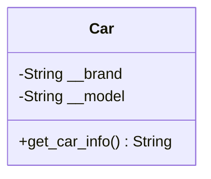
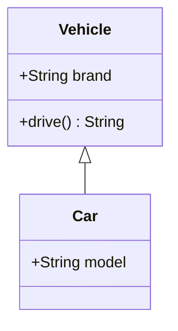
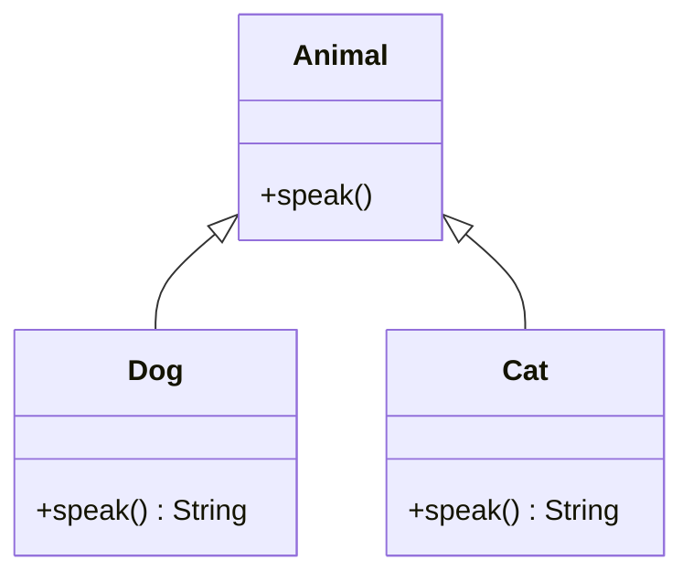
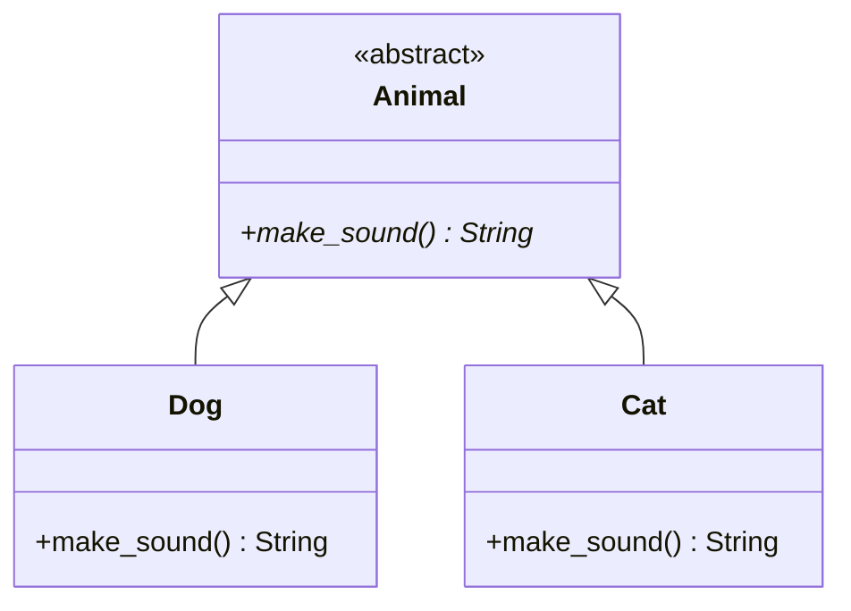

# Core Principles of OOP

## 🎯 Learning Objectives

By the end of this section, you should be able to:
- Understand and implement encapsulation to protect data integrity
- Create class hierarchies using inheritance to promote code reuse
- Apply polymorphism to write flexible, interchangeable code
- Use abstraction to hide complexity and expose clean interfaces

---

## 1. Encapsulation
Encapsulation is the practice of bundling data (variables) and methods that operate on the data into a single unit, usually a class. It restricts direct access to some components and protects the integrity of the object.



```python
class Car:
    def __init__(self, brand, model):
        self.__brand = brand  # Private variable
        self.__model = model  # Private variable

    def get_car_info(self):
        return f"{self.__brand} {self.__model}"

car = Car("Toyota", "Corolla")
print(car.get_car_info())  # Toyota Corolla
```

## 2. Inheritance
Inheritance allows a class (child) to inherit attributes and methods from another class (parent), promoting code reusability.



```python
class Vehicle:
    def __init__(self, brand):
        self.brand = brand
    
    def drive(self):
        return "Driving..."

class Car(Vehicle):
    def __init__(self, brand, model):
        super().__init__(brand)
        self.model = model

car = Car("Toyota", "Camry")
print(car.brand)  # Toyota
print(car.drive())  # Driving...
```

## 3. Polymorphism
Polymorphism allows different classes to be treated as instances of the same class through a shared interface. This enables methods to be used interchangeably.



```python
class Animal:
    def speak(self):
        pass

class Dog(Animal):
    def speak(self):
        return "Woof!"

class Cat(Animal):
    def speak(self):
        return "Meow!"

animals = [Dog(), Cat()]
for animal in animals:
    print(animal.speak())
```

## 4. Abstraction
Abstraction is the process of hiding the internal details of an implementation and only exposing relevant functionalities. It helps in reducing complexity by allowing the user to interact with an object at a high level without needing to understand its internal workings.

In Python, abstraction is typically implemented using abstract classes and methods.



```python
from abc import ABC, abstractmethod

class Animal(ABC):
    @abstractmethod
    def make_sound(self):
        """This method must be implemented by subclasses."""
        pass

class Dog(Animal):
    def make_sound(self):
        return "Bark"

class Cat(Animal):
    def make_sound(self):
        return "Meow"

# Cannot instantiate an abstract class
# animal = Animal()  # This would raise an error

dog = Dog()
print(dog.make_sound())  # Bark
```

By using abstraction, we enforce a contract that subclasses must follow, ensuring consistency and structure in the codebase.

---

## ⚠️ Anti-Patterns to Avoid

### 1. Over-Encapsulation
**Problem**: Creating getters and setters for everything without reason

```python
# ❌ Bad: Over-encapsulation
class Person:
    def __init__(self, name):
        self.__name = name
    
    def get_name(self):
        return self.__name
    
    def set_name(self, name):
        self.__name = name
```

**Solution**: Use properties when you need to add validation logic:

```python
# ✅ Good: Use properties for protected data when needed
class Person:
    def __init__(self, name):
        self._name = name
    
    @property
    def name(self):
        return self._name
    
    @name.setter
    def name(self, value):
        if not value:
            raise ValueError("Name cannot be empty")
        self._name = value
```

### 2. Deep Inheritance Hierarchies
**Problem**: Creating long chains of inheritance that are hard to maintain

```python
# ❌ Bad: Too deep hierarchy
class Vehicle:
    pass

class LandVehicle(Vehicle):
    pass

class FourWheelVehicle(LandVehicle):
    pass

class Car(FourWheelVehicle):
    pass
```

**Solution**: Use composition or flatter hierarchies:

```python
# ✅ Good: Use composition or interfaces
class Vehicle:
    def __init__(self, wheels, fuel_type):
        self.wheels = wheels
        self.fuel_type = fuel_type

class Engine:
    def __init__(self, power):
        self.power = power

class Car:
    def __init__(self, engine: Engine, wheels: int):
        self.engine = engine
        self.wheels = wheels
```

### 3. Breaking Polymorphism
**Problem**: Not respecting the Liskov Substitution Principle

```python
# ❌ Bad: Breaks polymorphism
class Bird:
    def fly(self):
        return "Flying..."

class Penguin(Bird):
    def fly(self):
        raise Exception("Penguins cannot fly!")
```

**Solution**: Design proper hierarchies or use composition:

```python
# ✅ Good: Separate flying birds from non-flying birds
class Bird:
    def __init__(self, name):
        self.name = name

class FlyingBird(Bird):
    def fly(self):
        return "Flying..."

class Penguin(Bird):
    def swim(self):
        return "Swimming..."
```
