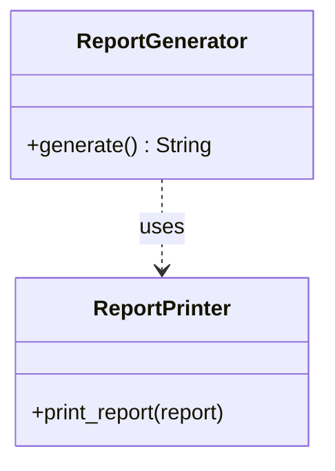
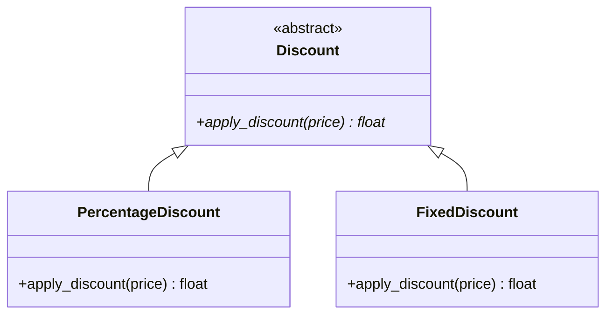
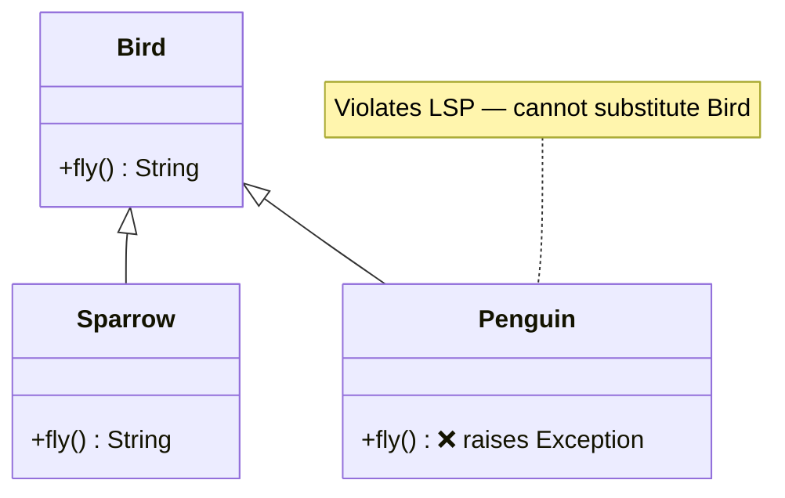
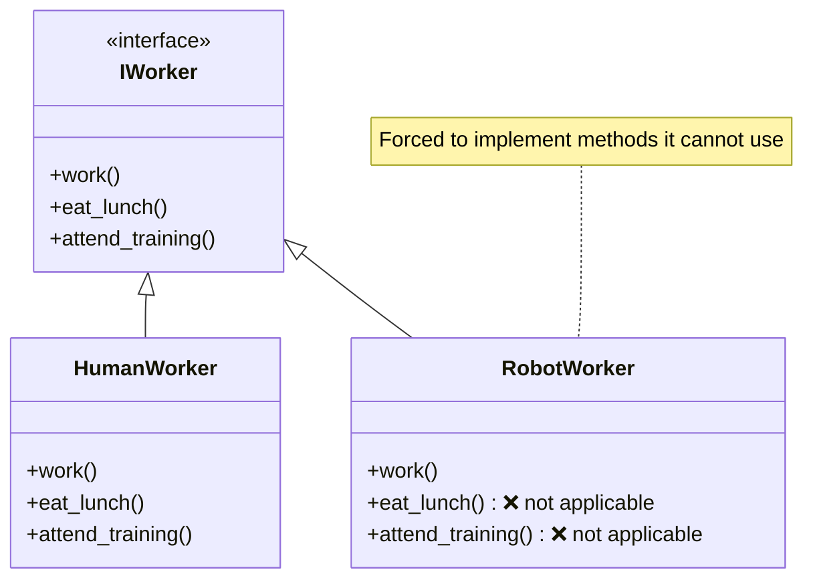
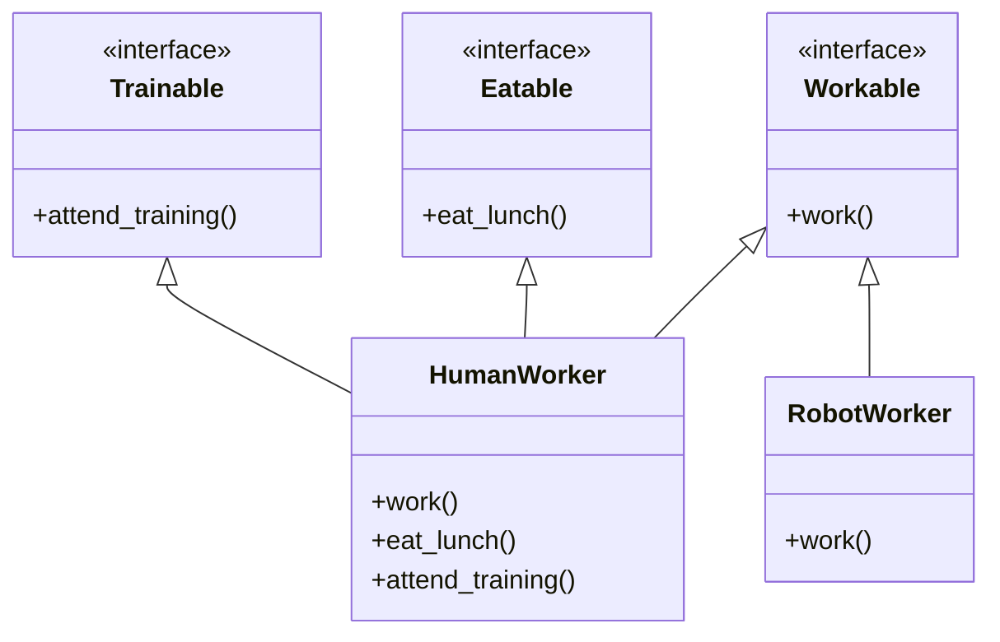
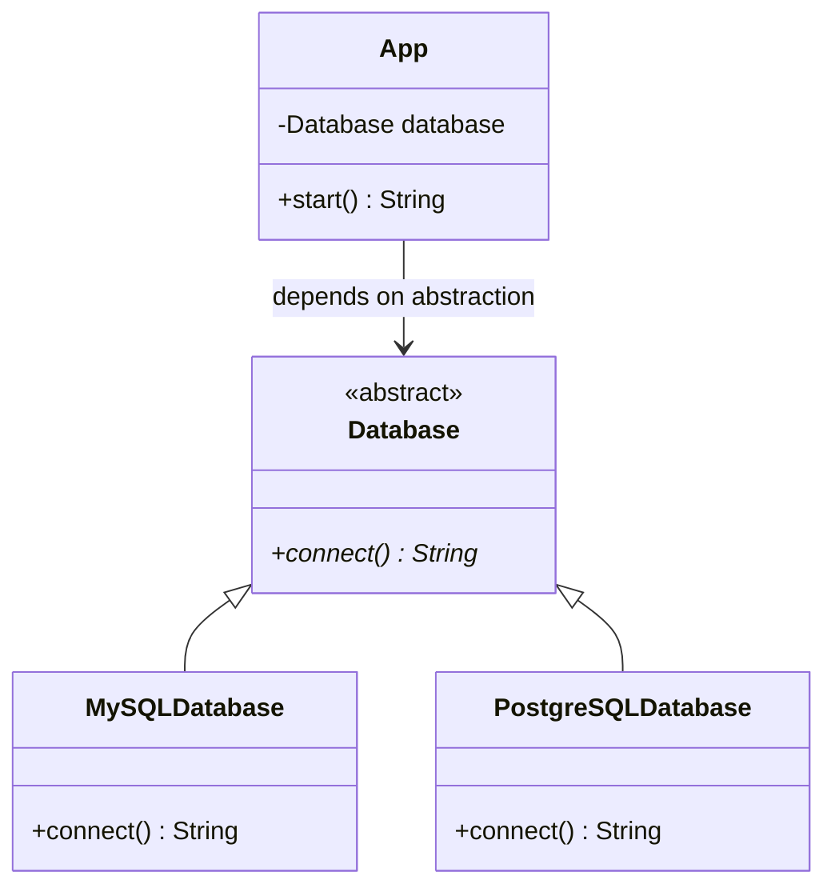

# SOLID Principles

## Learning Objectives

By the end of this section, you should understand:
- How to design classes with a single responsibility
- When to use inheritance vs. composition
- How to create flexible, extensible code
- The importance of proper dependency management
- How to design cohesive interfaces

---

The SOLID principles are five design principles that help improve software maintainability and scalability.

## 1. Single Responsibility Principle (SRP)
A class should have only one reason to change, meaning it should have only one job.



```python
class ReportGenerator:
    def generate(self):
        return "Report data"

class ReportPrinter:
    def print_report(self, report):
        print(report)

report = ReportGenerator().generate()
ReportPrinter().print_report(report)
```

## 2. Open/Closed Principle (OCP)
Entities should be open for extension but closed for modification.



```python
from abc import ABC, abstractmethod

class Discount(ABC):
    @abstractmethod
    def apply_discount(self, price):
        pass

class PercentageDiscount(Discount):
    def apply_discount(self, price):
        return price * 0.9  # 10% off

class FixedDiscount(Discount):
    def apply_discount(self, price):
        return price - 10

pricing = PercentageDiscount()
print(pricing.apply_discount(100))  # 90.0
```

## 3. Liskov Substitution Principle (LSP)
Subtypes must be substitutable for their base types without altering the correctness of the program.



```python
class Bird:
    def fly(self):
        return "Flying"

class Penguin(Bird):
    def fly(self):
        raise Exception("Penguins can't fly")

# Violates LSP because Penguin cannot fully replace Bird
```

## 4. Interface Segregation Principle (ISP)
Clients should not be forced to depend on interfaces they do not use.

In plain terms: **don't put too many methods in one interface**. If a class is forced to implement methods it doesn't need, the interface is too large and should be broken into smaller, more focused ones.

> 💡 **Analogy**: Imagine a job contract that requires every employee — whether a receptionist or a surgeon — to be able to operate an MRI scanner. The receptionist has no use for that clause; it just creates noise and confusion. Instead, give each role only the responsibilities that are relevant to it.

### ❌ The Problem — a "fat" interface

When a single interface bundles unrelated capabilities, classes that only need *some* of them are forced to implement *all* of them, even if that means raising `NotImplementedError` or simply doing nothing.



```python
# ❌ Bad: one fat interface forces Robot to implement irrelevant methods
class IWorker:
    def work(self):
        pass

    def eat_lunch(self):
        pass

    def attend_training(self):
        pass


class HumanWorker(IWorker):
    def work(self):
        return "Working..."

    def eat_lunch(self):
        return "Eating lunch..."

    def attend_training(self):
        return "Attending training..."


class RobotWorker(IWorker):
    def work(self):
        return "Working..."

    def eat_lunch(self):
        raise NotImplementedError("Robots don't eat")  # ❌ Forced

    def attend_training(self):
        raise NotImplementedError("Robots don't train")  # ❌ Forced
```

This breaks ISP because `RobotWorker` is coupled to behaviour it can never meaningfully implement. Any code that calls `worker.eat_lunch()` is fragile — it will crash at runtime if a `RobotWorker` is passed in.

### ✅ The Fix — segregate into focused interfaces

Split the fat interface into small, cohesive ones. Each class then only inherits the interfaces that are relevant to it.



```python
# ✅ Good: each interface has a single, focused responsibility
class Workable:
    def work(self):
        pass

class Eatable:
    def eat_lunch(self):
        pass

class Trainable:
    def attend_training(self):
        pass


class HumanWorker(Workable, Eatable, Trainable):
    def work(self):
        return "Working..."

    def eat_lunch(self):
        return "Eating lunch..."

    def attend_training(self):
        return "Attending training..."


class RobotWorker(Workable):
    """Robot only implements what it can actually do."""
    def work(self):
        return "Working..."


# Code that uses the interfaces is now safe and explicit
def run_shift(worker: Workable):
    """Works with any Workable — human or robot."""
    return worker.work()

def lunch_break(worker: Eatable):
    """Only called with workers that can eat — never a robot."""
    return worker.eat_lunch()
```

### Key takeaways

| Symptom | What it signals |
|---|---|
| A class raises `NotImplementedError` for an inherited method | Interface is too fat — split it |
| You pass `None` or a stub to satisfy a method you don't need | Same problem |
| Adding a method to an interface forces changes in many unrelated classes | Interface is doing too much |

> 📝 **Note**: Python does not have formal interfaces like Java or C#. We simulate them using abstract base classes (`ABC`) or simply by convention (duck typing). The principle is the same regardless of how the interface is expressed.

## 5. Dependency Inversion Principle (DIP)
High-level modules should not depend on low-level modules. Both should depend on abstractions.
You should depend on abstractions, not on concretions. This allows you to easily swap out implementations without changing the high-level code.



```python
class Database(ABC):
    @abstractmethod
    def connect(self):
        pass

class MySQLDatabase(Database):
    def connect(self):
        return "Connected to MySQL"

class App:
    def __init__(self, database: Database):
        self.database = database
    
    def start(self):
        return self.database.connect()

app = App(MySQLDatabase())
print(app.start())  # Connected to MySQL
```

---

## ⚠️ Anti-Patterns to Avoid

### 1. God Object (Violates SRP)
**Problem**: A class that does too much

```python
# ❌ Bad: User class handling too many responsibilities
class User:
    def __init__(self, name, email):
        self.name = name
        self.email = email
    
    def save_to_database(self):
        pass
    
    def send_email(self):
        pass
    
    def validate_email(self):
        pass
    
    def generate_report(self):
        pass
    
    def log_activity(self):
        pass
```

**Solution**: Split responsibilities into separate classes

```python
# ✅ Good: Each class has one responsibility
class User:
    def __init__(self, name, email):
        self.name = name
        self.email = email

class UserRepository:
    def save(self, user):
        pass

class EmailService:
    def send(self, user):
        pass

class EmailValidator:
    def validate(self, email):
        pass
```

### 2. Rigid Hierarchy (Violates OCP and LSP)
**Problem**: Classes that are hard to extend without modification

```python
# ❌ Bad: Adding new discount types requires modifying existing code
class DiscountCalculator:
    def calculate(self, discount_type, price):
        if discount_type == "percentage":
            return price * 0.9
        elif discount_type == "fixed":
            return price - 10
        elif discount_type == "buy_one_get_one":
            return price * 0.5
        # Adding new types requires modifying this method
```

**Solution**: Use the Strategy pattern with abstraction

```python
# ✅ Good: New discounts can be added without modifying existing code
from abc import ABC, abstractmethod

class DiscountStrategy(ABC):
    @abstractmethod
    def apply(self, price):
        pass

class PercentageDiscount(DiscountStrategy):
    def apply(self, price):
        return price * 0.9

class BuyOneGetOne(DiscountStrategy):
    def apply(self, price):
        return price * 0.5

class DiscountCalculator:
    def calculate(self, strategy: DiscountStrategy, price):
        return strategy.apply(price)
```

### 3. Complex Interfaces (Violates ISP)
**Problem**: Interfaces that force classes to implement methods they don't need

```python
# ❌ Bad: Worker interface is too complex
class Worker:
    def work(self):
        pass
    
    def eat_lunch(self):
        pass

class Robot(Worker):
    def work(self):
        return "Working..."
    
    def eat_lunch(self):
        raise Exception("Robots don't eat!")  # Forced to implement
```

**Solution**: Segregate interfaces into smaller, focused ones

```python
# ✅ Good: Separated interfaces
class Workable:
    def work(self):
        pass

class Eatable:
    def eat_lunch(self):
        pass

class Human(Workable, Eatable):
    def work(self):
        return "Working..."
    
    def eat_lunch(self):
        return "Eating..."

class Robot(Workable):
    def work(self):
        return "Working..."
```

### 4. Tight Coupling (Violates DIP)
**Problem**: High-level modules depend directly on low-level modules

```python
# ❌ Bad: NotificationService tightly coupled to EmailSender
class EmailSender:
    def send(self, message):
        print(f"Sending email: {message}")

class NotificationService:
    def __init__(self):
        self.sender = EmailSender()  # Direct dependency
    
    def notify(self, message):
        self.sender.send(message)
```

**Solution**: Depend on abstractions through dependency injection

```python
# ✅ Good: Depends on abstraction
from abc import ABC, abstractmethod

class MessageSender(ABC):
    @abstractmethod
    def send(self, message):
        pass

class EmailSender(MessageSender):
    def send(self, message):
        print(f"Sending email: {message}")

class NotificationService:
    def __init__(self, sender: MessageSender):
        self.sender = sender  # Injected dependency
    
    def notify(self, message):
        self.sender.send(message)
```
