# SOLID Principles

## Learning Objectives

By the end of this section, you should understand:
- How to design classes with a single responsibility
- When to use inheritance vs. composition
- How to create flexible, extensible code
- The importance of proper dependency management
- How to design cohesive interfaces

---

The SOLID principles are five design principles that help improve software maintainability and scalability.

## 1. Single Responsibility Principle (SRP)

> *"A class should have only one reason to change."*
> — Robert C. Martin

A class should do **one thing** and do it well. More precisely, it should have only **one actor** — one person, team, or external system — that has a reason to ask for it to change.

> 💡 **Analogy**: A surgeon's job is to operate. A nurse's job is to care. A receptionist's job is to schedule. If the surgeon were also expected to handle billing, update records, and order supplies, any change to *any one of those responsibilities* would require modifying the surgeon's role — introducing risk and confusion. Each role should exist for exactly one reason.

### What "one reason to change" really means

The phrase *"reason to change"* is not about lines of code or method count — it is about **who or what drives the change**. If you can imagine two different people asking you to change the same class for two unrelated reasons, the class has more than one responsibility.

Ask yourself: **"Who would ask me to change this class?"**

- The business team wants a different report format → `ReportFormatter`
- The DBA wants a different database schema → `ReportRepository`
- The ops team wants a different logging strategy → `AuditLogger`

If the answer involves more than one actor, the class needs to be split.

### ❌ The Problem — a class with multiple responsibilities

The classic sign of an SRP violation is a class that mixes concerns: data, persistence, formatting, validation, and communication all in one place.

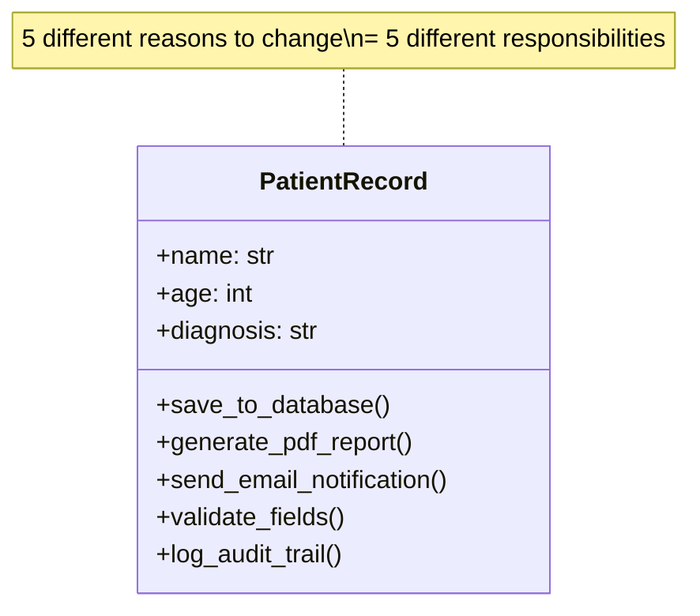

```python
# ❌ Bad: PatientRecord has at least five reasons to change
class PatientRecord:
    def __init__(self, name: str, age: int, diagnosis: str):
        self.name      = name
        self.age       = age
        self.diagnosis = diagnosis

    # Reason 1: data storage team changes the DB schema
    def save_to_database(self):
        print(f"INSERT INTO patients VALUES ('{self.name}', {self.age}, '{self.diagnosis}')")

    # Reason 2: design team changes the report layout
    def generate_pdf_report(self) -> str:
        return f"--- PATIENT REPORT ---\nName: {self.name}\nAge: {self.age}\nDiagnosis: {self.diagnosis}"

    # Reason 3: ops team changes the email provider or template
    def send_email_notification(self, recipient: str):
        print(f"Sending email to {recipient}: {self.name} has been diagnosed with {self.diagnosis}")

    # Reason 4: compliance team changes validation rules
    def validate_fields(self) -> bool:
        if not self.name:
            raise ValueError("Name is required")
        if self.age < 0 or self.age > 130:
            raise ValueError("Age must be between 0 and 130")
        return True

    # Reason 5: audit team changes what gets logged and how
    def log_audit_trail(self):
        print(f"AUDIT: Record created for patient {self.name}")
```

Every time *any one* of those five concerns changes — database schema, PDF layout, email provider, validation rules, audit format — you have to open `PatientRecord` and edit it. Each edit risks introducing a regression in all the other responsibilities bundled inside it.

### ✅ The Fix — one class, one responsibility

Split the class so that each piece of behaviour lives with the team or concern that owns it:

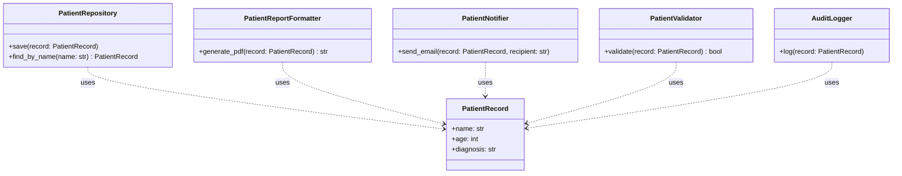

```python
# ✅ Good: each class has exactly one reason to change

class PatientRecord:
    """Owns only the data. Reason to change: the data model changes."""
    def __init__(self, name: str, age: int, diagnosis: str):
        self.name      = name
        self.age       = age
        self.diagnosis = diagnosis

    def __repr__(self) -> str:
        return f"PatientRecord(name={self.name!r}, age={self.age}, diagnosis={self.diagnosis!r})"


class PatientValidator:
    """Owns validation rules. Reason to change: compliance rules change."""
    def validate(self, record: PatientRecord) -> bool:
        if not record.name:
            raise ValueError("Name is required")
        if not (0 <= record.age <= 130):
            raise ValueError("Age must be between 0 and 130")
        return True


class PatientRepository:
    """Owns persistence. Reason to change: database schema or engine changes."""
    def save(self, record: PatientRecord):
        print(f"[DB] INSERT INTO patients VALUES ('{record.name}', {record.age}, '{record.diagnosis}')")

    def find_by_name(self, name: str) -> PatientRecord:
        print(f"[DB] SELECT * FROM patients WHERE name = '{name}'")
        return PatientRecord(name, 0, "unknown")  # simplified


class PatientReportFormatter:
    """Owns report layout. Reason to change: report format or design changes."""
    def generate_pdf(self, record: PatientRecord) -> str:
        return (
            f"--- PATIENT REPORT ---\n"
            f"Name      : {record.name}\n"
            f"Age       : {record.age}\n"
            f"Diagnosis : {record.diagnosis}\n"
        )


class PatientNotifier:
    """Owns notifications. Reason to change: email provider or template changes."""
    def send_email(self, record: PatientRecord, recipient: str):
        print(f"[EMAIL → {recipient}] {record.name} diagnosed: {record.diagnosis}")


class AuditLogger:
    """Owns audit trails. Reason to change: audit format or destination changes."""
    def log(self, record: PatientRecord):
        print(f"[AUDIT] Record created for {record.name}")


# --- Orchestration: assemble the pieces in a service ---

class PatientAdmissionService:
    def __init__(
        self,
        validator:  PatientValidator,
        repository: PatientRepository,
        notifier:   PatientNotifier,
        logger:     AuditLogger,
    ):
        self.validator  = validator
        self.repository = repository
        self.notifier   = notifier
        self.logger     = logger

    def admit(self, record: PatientRecord, doctor_email: str):
        self.validator.validate(record)
        self.repository.save(record)
        self.notifier.send_email(record, doctor_email)
        self.logger.log(record)


# Usage
service = PatientAdmissionService(
    validator  = PatientValidator(),
    repository = PatientRepository(),
    notifier   = PatientNotifier(),
    logger     = AuditLogger(),
)

patient = PatientRecord("Alice", 34, "Hypertension")
service.admit(patient, doctor_email="dr.smith@hospital.org")
```

Now if the compliance team changes the age limit, only `PatientValidator` changes. If the email provider is swapped, only `PatientNotifier` changes. None of those edits can accidentally break the others.

### Cohesion — the underlying concept

SRP is a manifestation of **cohesion**: the degree to which the elements of a class belong together. A highly cohesive class has methods and data that are all related to one concept. A low-cohesion class is a grab-bag of unrelated things.

| Cohesion level | What it looks like |
|---|---|
| **High** ✅ | All methods use most of the instance attributes |
| **Medium** ⚠️ | Some methods use only a subset of attributes |
| **Low** ❌ | Methods that don't use `self` at all, or use completely disjoint sets of attributes |

> 💡 A quick heuristic: if you find yourself writing a class where some methods never touch `self.x` and other methods never touch `self.y`, the class probably contains two classes.

### Common SRP violation signals

| Signal | What to look for |
|---|---|
| **"And" in the class name** | `UserManagerAndValidator`, `ReportBuilderAndSender` |
| **Methods that don't use `self`** | They belong in a utility class or static helper |
| **Large `__init__` receiving many unrelated dependencies** | The class is orchestrating too many concerns |
| **Test file is huge** | Each responsibility needs its own test setup — a sign the class does too much |
| **Frequent unrelated changes** | If the class changes every sprint for a different reason, it has too many owners |

### Practical checklist

Before committing a class, ask:

- [ ] Can I describe what this class does without using the word "and"?
- [ ] If I imagine two different people asking me to change this class, are they asking for the same kind of change?
- [ ] Do all methods use most of the instance's attributes?
- [ ] If I add a new feature elsewhere in the system, is this class unlikely to need editing?

If any answer is "no", consider splitting the class.

---

## 2. Open/Closed Principle (OCP)
Entities should be open for extension but closed for modification.

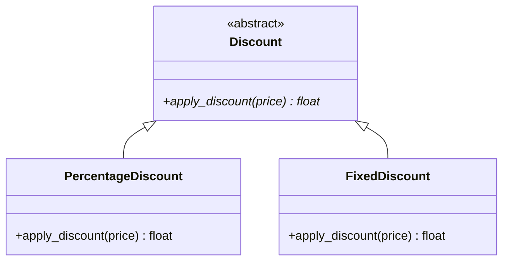

```python
from abc import ABC, abstractmethod

class Discount(ABC):
    @abstractmethod
    def apply_discount(self, price):
        pass

class PercentageDiscount(Discount):
    def apply_discount(self, price):
        return price * 0.9  # 10% off

class FixedDiscount(Discount):
    def apply_discount(self, price):
        return price - 10

pricing = PercentageDiscount()
print(pricing.apply_discount(100))  # 90.0
```

## 3. Liskov Substitution Principle (LSP)

> *"If S is a subtype of T, then objects of type T may be replaced with objects of type S without altering any of the desirable properties of the program."*
> — Barbara Liskov, 1987

In plain terms: **any child class must be usable wherever its parent class is expected, and the program must still behave correctly**. It is not enough for the types to be compatible — the *behaviour* must be compatible too.

> 💡 LSP is about honouring the **contract** of the parent class. A contract is the set of promises a class makes to its callers: what inputs it accepts, what it returns, and what side effects it has. A subclass must keep every one of those promises.

### What "substitutable" really means

Type compatibility alone is not enough. Consider this function:

```python
def make_bird_fly(bird: Bird) -> str:
    return bird.fly()
```

LSP says you must be able to pass **any subclass of `Bird`** to `make_bird_fly` and get a sensible string back — no exceptions, no `None`, no silent no-ops. If passing a `Penguin` causes the function to crash, the substitution is broken.

### The three behavioural rules

LSP has three concrete rules that a subclass must obey:

| Rule | What it means | Easy way to remember |
|---|---|---|
| **Preconditions cannot be strengthened** | The subclass must accept at least everything the parent accepts | *Don't be more demanding than your parent* |
| **Postconditions cannot be weakened** | The subclass must deliver at least everything the parent promised | *Don't deliver less than your parent promised* |
| **Invariants must be preserved** | Anything that is always true about the parent must remain true in the subclass | *Don't break the parent's guarantees* |

---

### ❌ The Classic Violation — Bird / Penguin

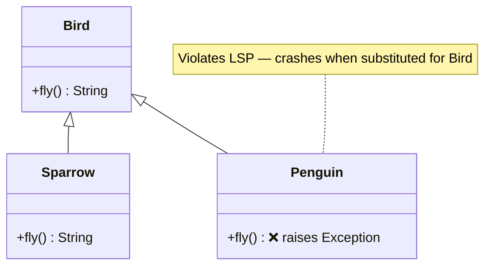

```python
class Bird:
    def fly(self) -> str:
        return "Flying"

class Sparrow(Bird):
    def fly(self) -> str:
        return "Sparrow flying"     # ✅ Keeps the parent's promise

class Penguin(Bird):
    def fly(self) -> str:
        raise Exception("Penguins can't fly!")  # ❌ Breaks the parent's promise

# Any code that uses Bird is now fragile:
def make_bird_fly(bird: Bird) -> str:
    return bird.fly()               # Crashes if bird is a Penguin

birds = [Sparrow(), Penguin()]
for bird in birds:
    print(make_bird_fly(bird))      # ❌ Raises Exception on the second iteration
```

**Why is this a violation?**
`Bird` promises that `fly()` returns a string. `Penguin` breaks that promise by raising an exception instead. Any caller that trusted the `Bird` contract now has a runtime crash it cannot anticipate.

### ✅ The Fix — restructure the hierarchy to reflect reality

The root cause is that the hierarchy is wrong. A `Penguin` is a bird biologically, but it is **not** a flying bird. The solution is to model what is *actually true*:

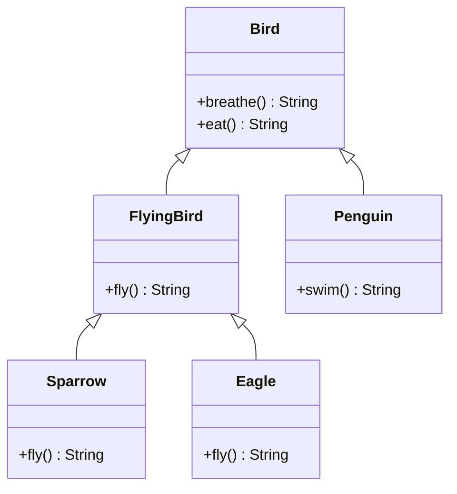

```python
class Bird:
    """All birds can breathe and eat."""
    def breathe(self) -> str:
        return "Breathing"

    def eat(self) -> str:
        return "Eating"

class FlyingBird(Bird):
    """Only flying birds promise fly()."""
    def fly(self) -> str:
        raise NotImplementedError   # Subclasses must implement

class Sparrow(FlyingBird):
    def fly(self) -> str:
        return "Sparrow flying low"

class Eagle(FlyingBird):
    def fly(self) -> str:
        return "Eagle soaring high"

class Penguin(Bird):
    """Penguin IS-A Bird, but is NOT a FlyingBird — no fly() contract."""
    def swim(self) -> str:
        return "Penguin swimming"


# Now make_bird_fly only accepts FlyingBird — the type system enforces LSP:
def make_bird_fly(bird: FlyingBird) -> str:
    return bird.fly()

print(make_bird_fly(Sparrow()))  # ✅ Sparrow flying low
print(make_bird_fly(Eagle()))    # ✅ Eagle soaring high
# make_bird_fly(Penguin())       # ✅ Type error at development time — not a runtime crash
```

---

### Medical domain example

A common LSP violation in real systems: subclasses that narrow what they accept (strengthen preconditions) or weaken what they return.

#### ❌ Violation — subclass strengthens preconditions

```python
class LabTest:
    def run(self, patient_age: int) -> str:
        """Run test for any patient."""
        return f"Running test for age {patient_age}"

class PaediatricLabTest(LabTest):
    def run(self, patient_age: int) -> str:
        if patient_age > 18:
            raise ValueError("This test is only for patients under 18")  # ❌
        return f"Running paediatric test for age {patient_age}"

def process_test(test: LabTest, age: int) -> str:
    return test.run(age)   # Caller trusts LabTest's contract: any age is fine

print(process_test(LabTest(), 45))            # ✅ Works
print(process_test(PaediatricLabTest(), 45))  # ❌ ValueError — substitution broken
```

`LabTest` promises `run()` works for any age. `PaediatricLabTest` narrows that to `age <= 18`. That is a stronger precondition — a direct LSP violation.

#### ✅ Fix — use the correct abstraction

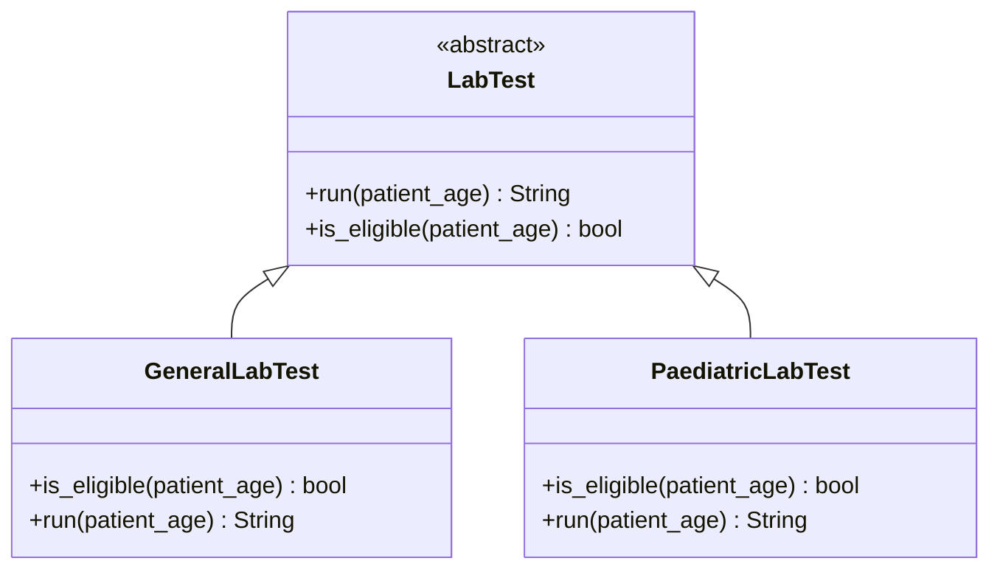

```python
from abc import ABC, abstractmethod

class LabTest(ABC):
    @abstractmethod
    def is_eligible(self, patient_age: int) -> bool:
        """Returns True if this test can be run for the given patient age."""
        ...

    @abstractmethod
    def run(self, patient_age: int) -> str:
        """Run the test. Only call if is_eligible() returned True."""
        ...

class GeneralLabTest(LabTest):
    def is_eligible(self, patient_age: int) -> bool:
        return True                  # ✅ No age restriction

    def run(self, patient_age: int) -> str:
        return f"General test for age {patient_age}"

class PaediatricLabTest(LabTest):
    def is_eligible(self, patient_age: int) -> bool:
        return patient_age <= 18    # ✅ Restriction is in the contract, not hidden

    def run(self, patient_age: int) -> str:
        return f"Paediatric test for age {patient_age}"


def process_test(test: LabTest, age: int) -> str:
    if not test.is_eligible(age):
        return f"Patient aged {age} is not eligible for this test"
    return test.run(age)            # ✅ Safe — eligibility always checked first

print(process_test(GeneralLabTest(),   45))  # General test for age 45
print(process_test(PaediatricLabTest(), 45)) # Patient aged 45 is not eligible
print(process_test(PaediatricLabTest(), 10)) # Paediatric test for age 10
```

The restriction is now part of the **contract** (`is_eligible`), not a hidden runtime exception. Every caller knows they must check eligibility first — and they can do that safely regardless of which subclass they are holding.

---

### Common LSP violation patterns

| Pattern | Example | Why it breaks LSP |
|---|---|---|
| **Raising an exception in an override** | `fly()` raises `Exception` in `Penguin` | Breaks the parent's postcondition (returns a value) |
| **Returning `None` where a value is expected** | `get_reading()` returns `None` in a subclass | Weakens the postcondition |
| **Strengthening input validation** | Subclass rejects ages `> 18`, parent accepts all | Strengthens the precondition |
| **Doing nothing (`pass`) in an override** | `save()` silently does nothing in a subclass | Breaks the caller's expectation of a side effect |
| **Overriding a method to check the type of `self`** | `if isinstance(self, Special): …` | The hierarchy is wrong — restructure it |

### Practical checklist

Before committing a subclass, ask:

- [ ] Can every method in the subclass be called with the same arguments as the parent?
- [ ] Does every method return a value that satisfies the same guarantees as the parent?
- [ ] Does any overridden method raise an exception that the parent never raised?
- [ ] Does any overridden method silently do nothing (`pass`) where the parent did something meaningful?
- [ ] Can I replace every use of the parent with this subclass and have all tests still pass?

If any answer is "no", the hierarchy needs to be restructured.

## 4. Interface Segregation Principle (ISP)
Clients should not be forced to depend on interfaces they do not use.

In plain terms: **don't put too many methods in one interface**. If a class is forced to implement methods it doesn't need, the interface is too large and should be broken into smaller, more focused ones.

> 💡 **Analogy**: Imagine a job contract that requires every employee — whether a receptionist or a surgeon — to be able to operate an MRI scanner. The receptionist has no use for that clause; it just creates noise and confusion. Instead, give each role only the responsibilities that are relevant to it.

### ❌ The Problem — a "fat" interface

When a single interface bundles unrelated capabilities, classes that only need *some* of them are forced to implement *all* of them, even if that means raising `NotImplementedError` or simply doing nothing.

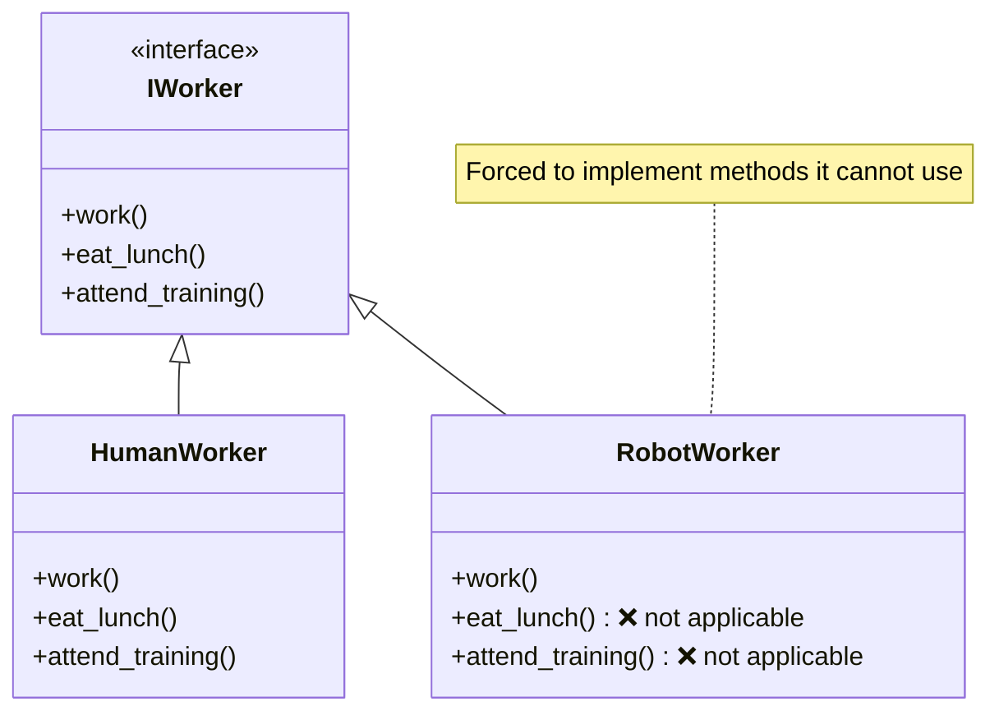

```python
# ❌ Bad: one fat interface forces Robot to implement irrelevant methods
class IWorker:
    def work(self):
        pass

    def eat_lunch(self):
        pass

    def attend_training(self):
        pass


class HumanWorker(IWorker):
    def work(self):
        return "Working..."

    def eat_lunch(self):
        return "Eating lunch..."

    def attend_training(self):
        return "Attending training..."


class RobotWorker(IWorker):
    def work(self):
        return "Working..."

    def eat_lunch(self):
        raise NotImplementedError("Robots don't eat")  # ❌ Forced

    def attend_training(self):
        raise NotImplementedError("Robots don't train")  # ❌ Forced
```

This breaks ISP because `RobotWorker` is coupled to behaviour it can never meaningfully implement. Any code that calls `worker.eat_lunch()` is fragile — it will crash at runtime if a `RobotWorker` is passed in.

### ✅ The Fix — segregate into focused interfaces

Split the fat interface into small, cohesive ones. Each class then only inherits the interfaces that are relevant to it.

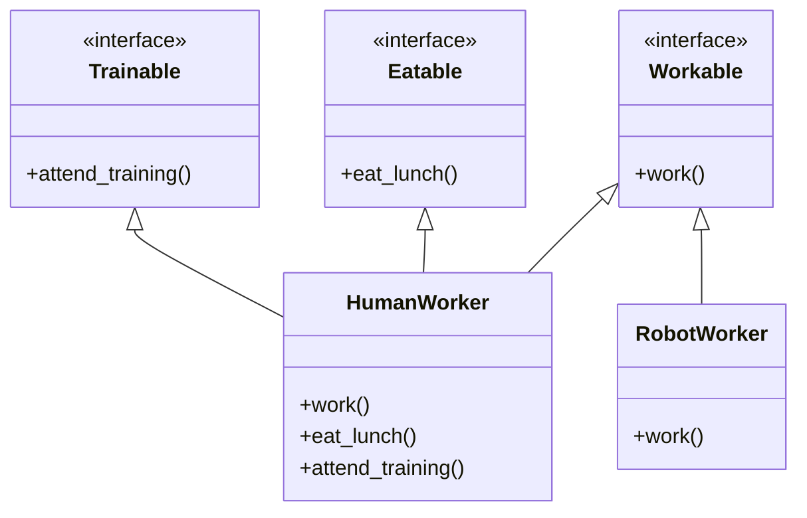

```python
# ✅ Good: each interface has a single, focused responsibility
class Workable:
    def work(self):
        pass

class Eatable:
    def eat_lunch(self):
        pass

class Trainable:
    def attend_training(self):
        pass


class HumanWorker(Workable, Eatable, Trainable):
    def work(self):
        return "Working..."

    def eat_lunch(self):
        return "Eating lunch..."

    def attend_training(self):
        return "Attending training..."


class RobotWorker(Workable):
    """Robot only implements what it can actually do."""
    def work(self):
        return "Working..."


# Code that uses the interfaces is now safe and explicit
def run_shift(worker: Workable):
    """Works with any Workable — human or robot."""
    return worker.work()

def lunch_break(worker: Eatable):
    """Only called with workers that can eat — never a robot."""
    return worker.eat_lunch()
```

### Key takeaways

| Symptom | What it signals |
|---|---|
| A class raises `NotImplementedError` for an inherited method | Interface is too fat — split it |
| You pass `None` or a stub to satisfy a method you don't need | Same problem |
| Adding a method to an interface forces changes in many unrelated classes | Interface is doing too much |

> **Note**: Python does not have formal interfaces like Java or C#. We simulate them using abstract base classes (`ABC`) or simply by convention (duck typing). The principle is the same regardless of how the interface is expressed.

## 5. Dependency Inversion Principle (DIP)

> *"High-level modules should not depend on low-level modules. Both should depend on abstractions. Abstractions should not depend on details. Details should depend on abstractions."*
> — Robert C. Martin

DIP has two rules, and both matter:

| Rule | What it means |
|---|---|
| **1. High-level modules must not depend on low-level modules** | Business logic should not be wired directly to infrastructure (databases, email services, file systems, APIs) |
| **2. Both should depend on abstractions** | The glue between them should be an interface or abstract class — not a concrete implementation |

> **Analogy**: A surgeon (high-level) does not depend on a specific scalpel brand (low-level). They depend on the *concept* of a scalpel — a sharp, sterile, handheld cutting instrument (abstraction). The hospital procurement team decides which brand (concrete detail) to supply. Swapping brands does not retrain the surgeon.

### High-level vs. low-level modules

Understanding these terms is key to applying DIP correctly:

| Module type | What it is | Examples |
|---|---|---|
| **High-level** | Expresses *what* the system does — business rules, use cases, domain logic | `PatientAdmissionService`, `DiagnosisEngine`, `BillingProcessor` |
| **Low-level** | Expresses *how* something is done — infrastructure, I/O, external services | `MySQLRepository`, `SmtpEmailSender`, `PdfReportWriter`, `RestApiClient` |

High-level modules are the *most valuable* part of a system — they encode the business rules. Low-level modules are swappable details. DIP ensures that a change in a low-level detail (switching from MySQL to PostgreSQL, from SMTP to SendGrid) never forces a change in the high-level business logic.

### What "inversion" means

Before DIP, the natural (naive) design points dependencies **downward**: high-level code imports and instantiates low-level code directly.

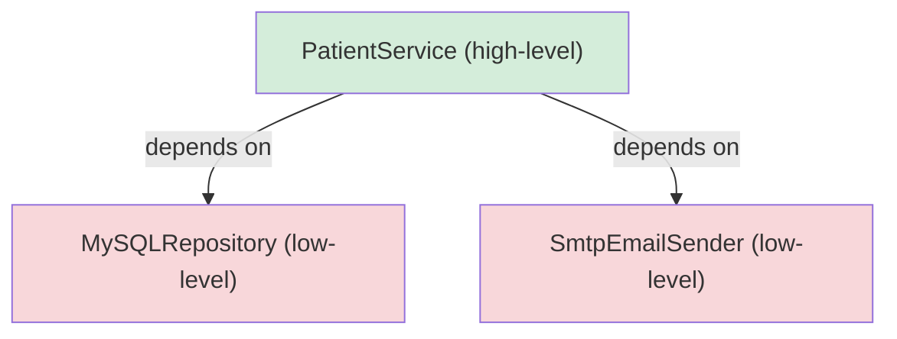

After DIP, both layers point **toward an abstraction** — the dependency arrows are inverted for the concrete classes:

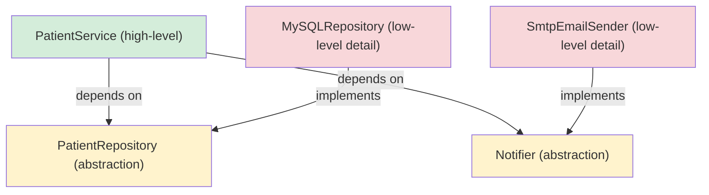

`PatientService` now knows nothing about MySQL or SMTP. It only knows about `PatientRepository` and `Notifier`. The concrete classes depend on those abstractions — not the other way around.

---

### ❌ The Problem — high-level wired to low-level

```python
# ❌ Bad: DiagnosisService is tightly coupled to concrete infrastructure

class MySQLPatientRepository:
    def get_patient(self, patient_id: str) -> dict:
        print(f"[MySQL] SELECT * FROM patients WHERE id = '{patient_id}'")
        return {"id": patient_id, "name": "Alice", "age": 34}

class SmtpEmailSender:
    def send(self, to: str, subject: str, body: str):
        print(f"[SMTP] Sending '{subject}' to {to}")

class FileAuditLogger:
    def log(self, message: str):
        print(f"[FILE LOG] {message}")


class DiagnosisService:
    def __init__(self):
        # ❌ DiagnosisService creates and owns the concrete classes
        # Swapping MySQL for PostgreSQL means editing DiagnosisService
        self.repository = MySQLPatientRepository()
        self.notifier   = SmtpEmailSender()
        self.logger     = FileAuditLogger()

    def record_diagnosis(self, patient_id: str, diagnosis: str):
        patient = self.repository.get_patient(patient_id)
        self.logger.log(f"Diagnosis recorded: {patient['name']} → {diagnosis}")
        self.notifier.send(
            to      = "dr.smith@hospital.org",
            subject = "New Diagnosis",
            body    = f"{patient['name']} has been diagnosed with {diagnosis}",
        )
        return f"Diagnosis '{diagnosis}' recorded for {patient['name']}"


service = DiagnosisService()
print(service.record_diagnosis("P001", "Hypertension"))
```

**What is wrong here:**

- `DiagnosisService` instantiates `MySQLPatientRepository` directly inside `__init__`. Switching to PostgreSQL means opening and editing `DiagnosisService`.
- `DiagnosisService` depends on `SmtpEmailSender`. Switching to SendGrid means the same.
- **You cannot test `DiagnosisService` in isolation** — every test will attempt a real MySQL connection and a real SMTP send.
- Every low-level detail leaks into the high-level business logic class.

---

### ✅ The Fix — depend on abstractions

**Step 1**: Define abstractions (interfaces) owned by the high-level layer.

```python
from abc import ABC, abstractmethod

# These abstractions live in the domain / high-level layer
# They describe WHAT the service needs — not HOW it is done

class PatientRepository(ABC):
    @abstractmethod
    def get_patient(self, patient_id: str) -> dict:
        """Return patient data for the given ID."""
        ...

class Notifier(ABC):
    @abstractmethod
    def send(self, to: str, subject: str, body: str):
        """Send a notification message."""
        ...

class AuditLogger(ABC):
    @abstractmethod
    def log(self, message: str):
        """Write an audit entry."""
        ...
```

**Step 2**: High-level service depends only on those abstractions — never on concrete classes.

```python
class DiagnosisService:
    """High-level business logic. Depends only on abstractions."""

    def __init__(
        self,
        repository: PatientRepository,   # ✅ abstraction
        notifier:   Notifier,            # ✅ abstraction
        logger:     AuditLogger,         # ✅ abstraction
    ):
        self.repository = repository
        self.notifier   = notifier
        self.logger     = logger

    def record_diagnosis(self, patient_id: str, diagnosis: str) -> str:
        patient = self.repository.get_patient(patient_id)
        self.logger.log(f"Diagnosis recorded: {patient['name']} → {diagnosis}")
        self.notifier.send(
            to      = "dr.smith@hospital.org",
            subject = "New Diagnosis",
            body    = f"{patient['name']} has been diagnosed with {diagnosis}",
        )
        return f"Diagnosis '{diagnosis}' recorded for {patient['name']}"
```

**Step 3**: Low-level modules implement the abstractions — they depend on the abstraction, not the other way around.

```python
# Each concrete class depends on an abstraction defined above

class MySQLPatientRepository(PatientRepository):
    def get_patient(self, patient_id: str) -> dict:
        print(f"[MySQL] SELECT * FROM patients WHERE id = '{patient_id}'")
        return {"id": patient_id, "name": "Alice", "age": 34}

class PostgreSQLPatientRepository(PatientRepository):
    def get_patient(self, patient_id: str) -> dict:
        print(f"[PostgreSQL] SELECT * FROM patients WHERE id = '{patient_id}'")
        return {"id": patient_id, "name": "Alice", "age": 34}

class SmtpEmailSender(Notifier):
    def send(self, to: str, subject: str, body: str):
        print(f"[SMTP] Sending '{subject}' to {to}")

class SendGridEmailSender(Notifier):
    def send(self, to: str, subject: str, body: str):
        print(f"[SendGrid API] Sending '{subject}' to {to}")

class FileAuditLogger(AuditLogger):
    def log(self, message: str):
        print(f"[FILE LOG] {message}")

class CloudAuditLogger(AuditLogger):
    def log(self, message: str):
        print(f"[CLOUD LOG] {message}")
```

**Step 4**: Assemble the system at the outermost layer (the composition root).

```python
# Production: use real infrastructure
service = DiagnosisService(
    repository = MySQLPatientRepository(),
    notifier   = SmtpEmailSender(),
    logger     = FileAuditLogger(),
)
print(service.record_diagnosis("P001", "Hypertension"))

# Switching the database? One line:
service = DiagnosisService(
    repository = PostgreSQLPatientRepository(),  # ✅ swap here only
    notifier   = SmtpEmailSender(),
    logger     = FileAuditLogger(),
)
```

**Step 5**: Testing becomes trivial — inject in-memory fakes instead of real infrastructure.

```python
# Test: inject lightweight fakes — no MySQL, no SMTP, no files needed

class FakePatientRepository(PatientRepository):
    def get_patient(self, patient_id: str) -> dict:
        return {"id": patient_id, "name": "Test Patient", "age": 25}

class FakeNotifier(Notifier):
    def __init__(self):
        self.sent: list[dict] = []

    def send(self, to: str, subject: str, body: str):
        self.sent.append({"to": to, "subject": subject, "body": body})

class FakeAuditLogger(AuditLogger):
    def __init__(self):
        self.entries: list[str] = []

    def log(self, message: str):
        self.entries.append(message)


# In a test:
notifier = FakeNotifier()
logger   = FakeAuditLogger()
service  = DiagnosisService(
    repository = FakePatientRepository(),
    notifier   = notifier,
    logger     = logger,
)

result = service.record_diagnosis("P001", "Hypertension")

assert result == "Diagnosis 'Hypertension' recorded for Test Patient"
assert len(notifier.sent) == 1
assert notifier.sent[0]["subject"] == "New Diagnosis"
assert len(logger.entries) == 1
# ✅ Fast, reliable, no infrastructure required
```

---

### DIP vs. Dependency Injection — they are not the same thing

This is one of the most common points of confusion:

| | What it is |
|---|---|
| **Dependency Inversion Principle (DIP)** | A *design principle* about the direction of dependencies — high-level code should not point at low-level code. Both should point at abstractions. |
| **Dependency Injection (DI)** | A *technique* for supplying dependencies from the outside (via constructor, method, or property) rather than creating them inside the class. |

DI is the most common way to *achieve* DIP, but they are not the same:

```python
# DI without DIP — still violates DIP because the concrete class is injected,
# not an abstraction:
class DiagnosisService:
    def __init__(self, repository: MySQLPatientRepository):  # ❌ concrete type
        self.repository = repository

# DIP with DI — correct: inject the abstraction, resolve the concrete at the edge
class DiagnosisService:
    def __init__(self, repository: PatientRepository):       # ✅ abstract type
        self.repository = repository
```

> 💡 The rule of thumb: the type hint on `__init__` parameters should be an abstract class or protocol, never a concrete implementation class.

---

### The full class diagram

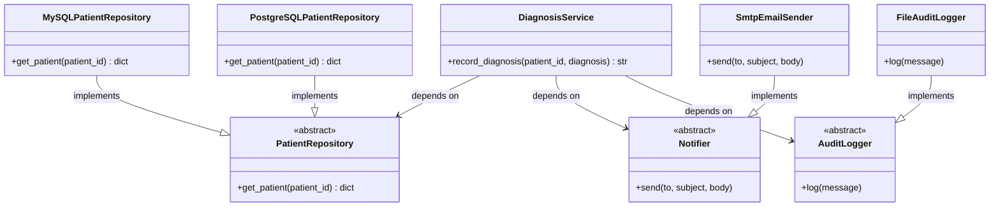

`DiagnosisService` points only at the three abstractions. The concrete classes point at those same abstractions. Neither layer points directly at the other.

---

### Common DIP violation patterns

| Pattern | What it looks like | Why it breaks DIP |
|---|---|---|
| **Instantiating inside `__init__`** | `self.repo = MySQLRepository()` | High-level wired to low-level; impossible to swap or test |
| **Type-hinting a concrete class** | `def __init__(self, repo: MySQLRepository)` | Callers are forced to supply a specific implementation |
| **Using `import` to pull in infrastructure** | `from services.mysql import MySQLRepository` at the top of a business-logic file | The module itself now depends on the concrete detail |
| **`if/elif` to select an implementation** | `if mode == "mysql": self.repo = MySQL()` | The selection logic should live at the composition root, not inside the service |
| **Singletons accessed globally** | `db = Database.get_instance()` inside a method | Hidden dependency — impossible to replace without monkey-patching |

### Practical checklist

Before committing a class, ask:

- [ ] Does `__init__` receive dependencies as parameters rather than creating them internally?
- [ ] Are all dependency type hints abstract classes or protocols — not concrete classes?
- [ ] Can I swap every dependency for a fake in a test without editing the class?
- [ ] Does this class import any infrastructure module (database driver, HTTP library, file system)?
- [ ] If a low-level implementation changes, is this class guaranteed not to need editing?

If any answer is "no", the class is not following DIP.

---

## ⚠️ Anti-Patterns to Avoid

### 1. God Object (Violates SRP)
**Problem**: A class that does too much

```python
# ❌ Bad: User class handling too many responsibilities
class User:
    def __init__(self, name, email):
        self.name = name
        self.email = email
    
    def save_to_database(self):
        pass
    
    def send_email(self):
        pass
    
    def validate_email(self):
        pass
    
    def generate_report(self):
        pass
    
    def log_activity(self):
        pass
```

**Solution**: Split responsibilities into separate classes

```python
# ✅ Good: Each class has one responsibility
class User:
    def __init__(self, name, email):
        self.name = name
        self.email = email

class UserRepository:
    def save(self, user):
        pass

class EmailService:
    def send(self, user):
        pass

class EmailValidator:
    def validate(self, email):
        pass
```

### 2. Rigid Hierarchy (Violates OCP and LSP)
**Problem**: Classes that are hard to extend without modification

```python
# ❌ Bad: Adding new discount types requires modifying existing code
class DiscountCalculator:
    def calculate(self, discount_type, price):
        if discount_type == "percentage":
            return price * 0.9
        elif discount_type == "fixed":
            return price - 10
        elif discount_type == "buy_one_get_one":
            return price * 0.5
        # Adding new types requires modifying this method
```

**Solution**: Use the Strategy pattern with abstraction

```python
# ✅ Good: New discounts can be added without modifying existing code
from abc import ABC, abstractmethod

class DiscountStrategy(ABC):
    @abstractmethod
    def apply(self, price):
        pass

class PercentageDiscount(DiscountStrategy):
    def apply(self, price):
        return price * 0.9

class BuyOneGetOne(DiscountStrategy):
    def apply(self, price):
        return price * 0.5

class DiscountCalculator:
    def calculate(self, strategy: DiscountStrategy, price):
        return strategy.apply(price)
```

### 3. Complex Interfaces (Violates ISP)
**Problem**: Interfaces that force classes to implement methods they don't need

```python
# ❌ Bad: Worker interface is too complex
class Worker:
    def work(self):
        pass
    
    def eat_lunch(self):
        pass

class Robot(Worker):
    def work(self):
        return "Working..."
    
    def eat_lunch(self):
        raise Exception("Robots don't eat!")  # Forced to implement
```

**Solution**: Segregate interfaces into smaller, focused ones

```python
# ✅ Good: Separated interfaces
class Workable:
    def work(self):
        pass

class Eatable:
    def eat_lunch(self):
        pass

class Human(Workable, Eatable):
    def work(self):
        return "Working..."
    
    def eat_lunch(self):
        return "Eating..."

class Robot(Workable):
    def work(self):
        return "Working..."
```

### 4. Tight Coupling (Violates DIP)
**Problem**: High-level modules depend directly on low-level modules

```python
# ❌ Bad: NotificationService tightly coupled to EmailSender
class EmailSender:
    def send(self, message):
        print(f"Sending email: {message}")

class NotificationService:
    def __init__(self):
        self.sender = EmailSender()  # Direct dependency
    
    def notify(self, message):
        self.sender.send(message)
```

**Solution**: Depend on abstractions through dependency injection

```python
# ✅ Good: Depends on abstraction
from abc import ABC, abstractmethod

class MessageSender(ABC):
    @abstractmethod
    def send(self, message):
        pass

class EmailSender(MessageSender):
    def send(self, message):
        print(f"Sending email: {message}")

class NotificationService:
    def __init__(self, sender: MessageSender):
        self.sender = sender  # Injected dependency
    
    def notify(self, message):
        self.sender.send(message)
```

---

[Back to Menu](../README.md) | [Previous: Core Concepts](./01_core_concepts.md) | [Next: Design Patterns](./04_design_patterns.md)

