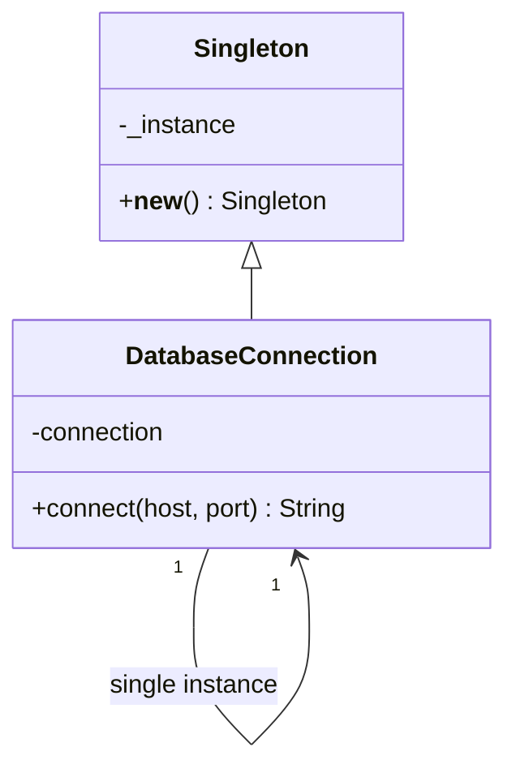
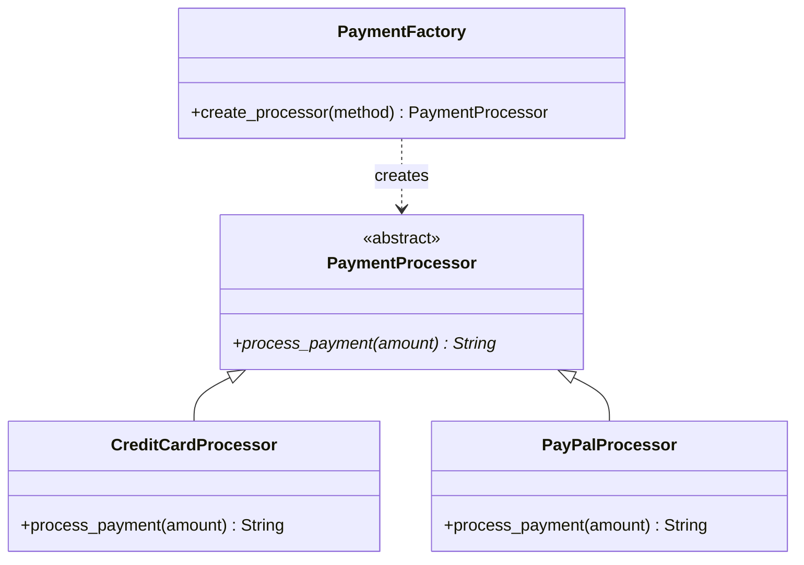
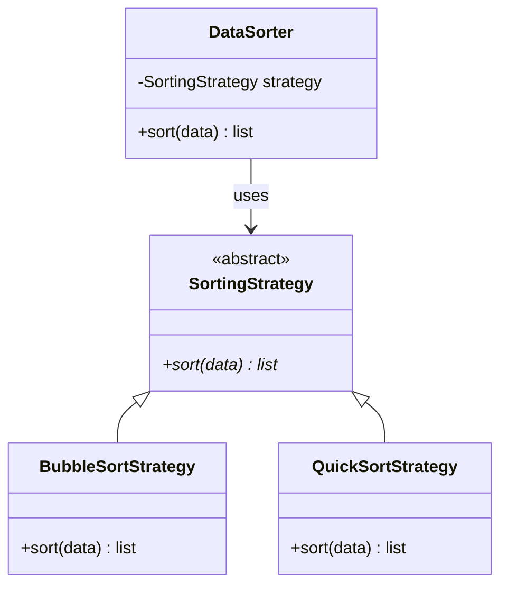
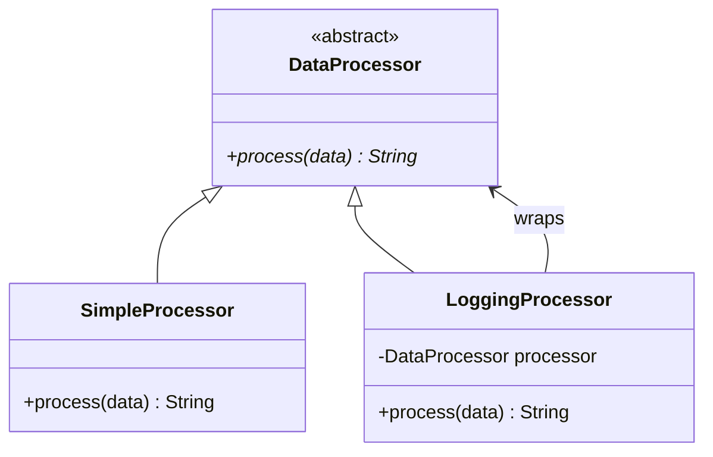
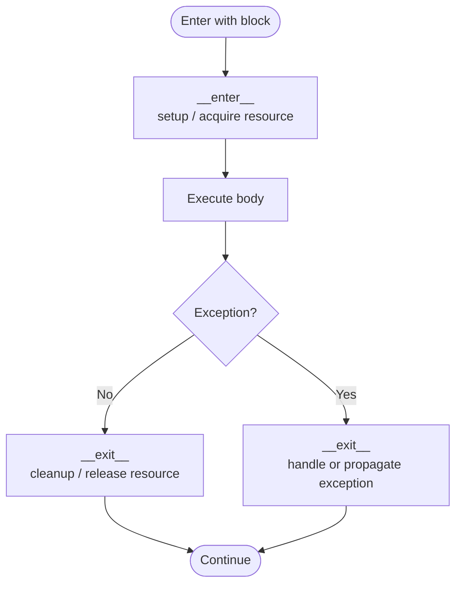
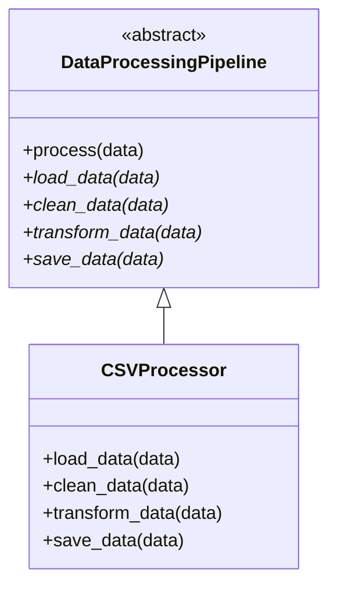
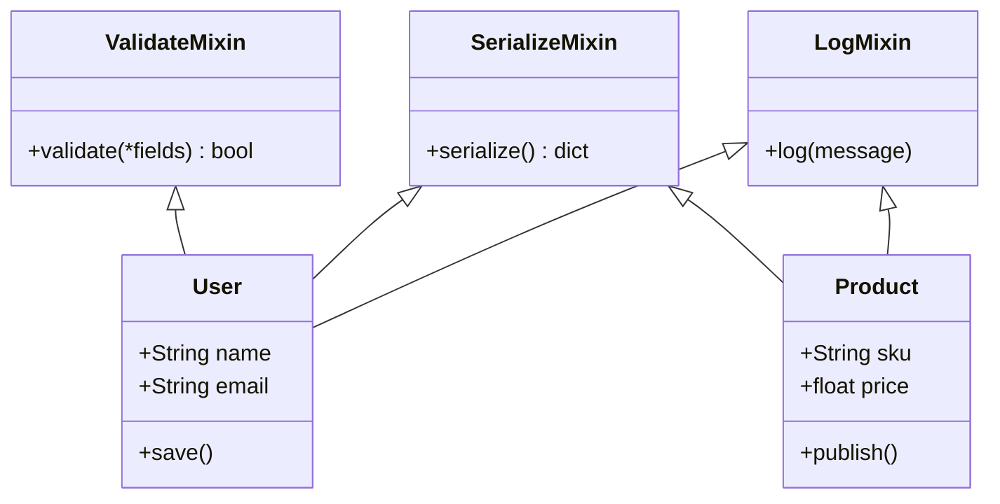

# Design Patterns & Best Practices

## Overview

**Design patterns** are reusable solutions to commonly occurring problems in software design. They are not finished pieces of code you copy and paste — they are templates or blueprints that describe how to solve a problem in a way that has been proven to work across many different contexts.

The concept was popularised by the "Gang of Four" (GoF) book *Design Patterns: Elements of Reusable Object-Oriented Software* (1994), which catalogued 23 classic patterns grouped into three categories:

| Category | Purpose | Examples |
|---|---|---|
| **Creational** | How objects are created | Singleton, Factory |
| **Structural** | How objects are composed | Decorator, Adapter, Mixin |
| **Behavioural** | How objects communicate | Strategy, Observer, Template Method |

### Why use design patterns?

- **Proven solutions**: They capture best practices refined over decades of software engineering
- **Common vocabulary**: Saying "use a Factory here" instantly communicates intent to other developers
- **Avoid reinventing the wheel**: Saves time and reduces the risk of subtle design mistakes
- **Improve maintainability**: Well-known patterns are easier to understand, extend, and debug

### When *not* to use them

Patterns can be overused. Forcing a pattern where a simpler solution exists makes code harder to read, not easier. Always ask: *does this pattern solve an actual problem I have right now?* If not, keep it simple (YAGNI — You Aren't Gonna Need It).

---

This section covers seven of the most commonly used patterns in Python development, all of which build directly on the OOP and SOLID principles covered earlier.

---

## 1. Singleton Pattern (Creational)

**Purpose**: Ensure a class has only one instance and provide a global point of access to it.

**When to Use**: Configuration managers, database connections, logging systems



```python
class Singleton:
    _instance = None
    
    def __new__(cls):  # Override __new__ to control instance creation
        if cls._instance is None:
            cls._instance = super().__new__(cls)
        return cls._instance

class DatabaseConnection(Singleton):
    def __init__(self):
        self.connection = None
    
    def connect(self, host: str, port: int):
        self.connection = f"Connected to {host}:{port}"
        return self.connection

# Usage
db1 = DatabaseConnection()
db2 = DatabaseConnection()
assert db1 is db2  # Same instance
```

**⚠️ Considerations**:
- Can make testing difficult (global state)
- Thread safety issues in multi-threaded environments
- Consider dependency injection as alternative

---

## 2. Factory Pattern (Creational)

**Purpose**: Create objects without specifying their exact classes.

**When to Use**: Different object creation based on conditions, plugin systems



```python
from abc import ABC, abstractmethod

class PaymentProcessor(ABC):
    @abstractmethod
    def process_payment(self, amount: float):
        pass

class CreditCardProcessor(PaymentProcessor):
    def process_payment(self, amount: float):
        return f"Processing ${amount} via Credit Card"

class PayPalProcessor(PaymentProcessor):
    def process_payment(self, amount: float):
        return f"Processing ${amount} via PayPal"

class PaymentFactory:
    @staticmethod
    def create_processor(payment_method: str) -> PaymentProcessor:
        processors = {
            "credit_card": CreditCardProcessor,
            "paypal": PayPalProcessor,
        }
        processor_class = processors.get(payment_method)
        if processor_class is None:
            raise ValueError(f"Unknown payment method: {payment_method}")
        return processor_class()

# Usage
processor = PaymentFactory.create_processor("credit_card")
print(processor.process_payment(99.99))
```

**Benefits**:
- Decouples object creation from usage
- Easy to add new types
- Follows OCP and DIP

---

## 3. Strategy Pattern (Behavioural)

**Purpose**: Define a family of algorithms, encapsulate each one, and make them interchangeable.

**When to Use**: Sorting/filtering options, compression algorithms, payment methods



```python
from abc import ABC, abstractmethod

class SortingStrategy(ABC):
    @abstractmethod
    def sort(self, data: list):
        pass

class BubbleSortStrategy(SortingStrategy):
    def sort(self, data: list):
        # Bubble sort implementation
        return sorted(data)

class QuickSortStrategy(SortingStrategy):
    def sort(self, data: list):
        # Quick sort implementation
        return sorted(data)

class DataSorter:
    def __init__(self, strategy: SortingStrategy):
        self.strategy = strategy
    
    def sort(self, data: list):
        return self.strategy.sort(data)

# Usage
data = [5, 2, 8, 1, 9]
sorter = DataSorter(QuickSortStrategy())
print(sorter.sort(data))
```

**vs Factory Pattern**:
- Factory: WHAT to create
- Strategy: HOW to do something

---

## 4. Decorator Pattern (Structural)

**Purpose**: Attach additional responsibilities to an object dynamically.

**When to Use**: Adding features to existing objects, caching, logging, authorization



```python
from functools import wraps
from abc import ABC, abstractmethod

# Function-based decorator
def log_execution(func):
    @wraps(func)
    def wrapper(*args, **kwargs):
        print(f"Calling {func.__name__}")
        result = func(*args, **kwargs)
        print(f"Finished {func.__name__}")
        return result
    return wrapper

@log_execution
def fetch_data(user_id: int):
    return f"Data for user {user_id}"

# Class-based decorator
class DataProcessor(ABC):
    @abstractmethod
    def process(self, data):
        pass

class SimpleProcessor(DataProcessor):
    def process(self, data):
        return f"Processed: {data}"

class LoggingProcessor(DataProcessor):
    def __init__(self, processor: DataProcessor):
        self.processor = processor
    
    def process(self, data):
        print(f"Processing: {data}")
        result = self.processor.process(data)
        print(f"Completed")
        return result

# Usage
processor = SimpleProcessor()
logged_processor = LoggingProcessor(processor)
print(logged_processor.process("important data"))
```

**Benefits**:
- Single Responsibility: Each decorator does one thing
- Flexible: Combine multiple decorators
- Better than subclassing

---

## 5. Context Manager Pattern (Structural)

**Purpose**: Manage resource allocation and cleanup (setup and teardown).

**When to Use**: File handling, database transactions, locks, temporary state



```python
class DatabaseConnection:
    def __init__(self, connection_string: str):
        self.connection_string = connection_string
        self.connection = None
    
    def __enter__(self):
        """Setup: called when entering with block"""
        self.connection = f"Connected to {self.connection_string}"
        print(f"Opening: {self.connection}")
        return self
    
    def __exit__(self, exc_type, exc_val, exc_tb):
        """Cleanup: called when exiting with block"""
        print("Closing connection")
        self.connection = None
        if exc_type:
            print(f"Error occurred: {exc_val}")
        return False  # Don't suppress exceptions
    
    def query(self, sql: str):
        return f"Result of: {sql}"

# Usage
with DatabaseConnection("localhost:5432") as db:
    result = db.query("SELECT * FROM users")
    print(result)
# Connection is automatically closed
```

**Using contextlib**:
```python
from contextlib import contextmanager

@contextmanager
def database_connection(connection_string: str):
    connection = f"Connected to {connection_string}"
    print(f"Opening: {connection}")
    try:
        yield connection
    finally:
        print("Closing connection")

# Usage
with database_connection("localhost:5432") as conn:
    print(f"Using: {conn}")
```

---

## 6. Template Method Pattern (Behavioural)

**Purpose**: Define skeleton of algorithm in base class, let subclasses implement specific steps.

**When to Use**: Processing pipelines, workflows, reporting



```python
from abc import ABC, abstractmethod

class DataProcessingPipeline(ABC):
    """Template method pattern"""
    
    def process(self, data):
        """Template method: defines the skeleton"""
        raw_data = self.load_data(data)
        cleaned_data = self.clean_data(raw_data)
        transformed_data = self.transform_data(cleaned_data)
        result = self.save_data(transformed_data)
        return result
    
    @abstractmethod
    def load_data(self, data):
        pass
    
    @abstractmethod
    def clean_data(self, data):
        pass
    
    @abstractmethod
    def transform_data(self, data):
        pass
    
    @abstractmethod
    def save_data(self, data):
        pass

class CSVProcessor(DataProcessingPipeline):
    def load_data(self, data):
        return [row.split(',') for row in data.split('\n')]
    
    def clean_data(self, data):
        return [[cell.strip() for cell in row] for row in data]
    
    def transform_data(self, data):
        return [dict(zip(['name', 'age'], row)) for row in data]
    
    def save_data(self, data):
        print(f"Saved {len(data)} records")
        return data
```

---

## 7. Mixin Pattern (Structural)

**Purpose**: Add reusable, self-contained behaviour to a class without using deep inheritance.

A **Mixin** is a class that provides methods to other classes but is never intended to be instantiated on its own. Instead of building a tall inheritance hierarchy, you compose a class out of several small, focused Mixins — each responsible for one piece of behaviour.

This is Python's idiomatic answer to the question: *"How do I share behaviour between classes that don't belong to the same hierarchy?"*

**When to Use**:
- Sharing utility behaviour (logging, serialisation, validation) across unrelated classes
- Avoiding code duplication without forcing an "is-a" relationship
- Keeping classes small and focused (supports SRP)



```python
# --- Mixins: each adds one focused capability ---

class LogMixin:
    """Adds logging capability to any class."""
    def log(self, message: str):
        print(f"[{self.__class__.__name__}] {message}")


class SerializeMixin:
    """Adds JSON-like serialisation to any class."""
    def serialize(self) -> dict:
        return {k: v for k, v in self.__dict__.items() if not k.startswith('_')}


class ValidateMixin:
    """Adds a simple field-presence validator to any class."""
    def validate(self, *required_fields: str) -> bool:
        missing = [f for f in required_fields if not getattr(self, f, None)]
        if missing:
            raise ValueError(f"Missing required fields: {missing}")
        return True


# --- Compose classes from Mixins ---

class User(LogMixin, SerializeMixin, ValidateMixin):
    def __init__(self, name: str, email: str):
        self.name = name
        self.email = email

    def save(self):
        self.validate("name", "email")   # from ValidateMixin
        self.log(f"Saving user {self.name}")  # from LogMixin
        return self.serialize()           # from SerializeMixin


class Product(LogMixin, SerializeMixin):
    def __init__(self, sku: str, price: float):
        self.sku = sku
        self.price = price

    def publish(self):
        self.log(f"Publishing product {self.sku}")
        return self.serialize()


# Usage
user = User("Alice", "alice@example.com")
print(user.save())
# [User] Saving user Alice
# {'name': 'Alice', 'email': 'alice@example.com'}

product = Product("SKU-001", 29.99)
print(product.publish())
# [Product] Publishing product SKU-001
# {'sku': 'SKU-001', 'price': 29.99}
```

### Mixin Naming Convention

By convention, Mixin classes are suffixed with `Mixin` to make their intent clear and signal that they should not be instantiated alone:

```python
class LogMixin: ...       # ✅ Clear intent
class Loggable: ...       # ✅ Also acceptable
class Log: ...            # ❌ Too generic — could be confused with a standalone class
```

### Mixin vs Inheritance vs Composition

| Approach | Relationship | Best for |
|---|---|---|
| **Inheritance** | "is-a" | Core identity (`Dog` is an `Animal`) |
| **Mixin** | "can-do" | Shared behaviour across unrelated classes |
| **Composition** | "has-a" | Delegating to a dedicated object |

### ⚠️ Things to Watch Out For

- **Method Resolution Order (MRO)**: Python resolves method names left-to-right across base classes. Use `super()` consistently to avoid surprises.
- **Don't add state**: Mixins should only add methods, not `__init__` logic or instance variables, to stay predictable.
- **Keep them small**: A Mixin that does too much is a code smell — split it.

```python
# Checking MRO
print(User.__mro__)
# (<class 'User'>, <class 'LogMixin'>, <class 'SerializeMixin'>, <class 'ValidateMixin'>, <class 'object'>)
```

---

## Best Practices Summary

### 1. **Composition Over Inheritance**
```python
# ❌ Bad: Deep inheritance
class Vehicle: pass
class LandVehicle(Vehicle): pass
class Car(LandVehicle): pass

# ✅ Good: Use composition
class Vehicle:
    def __init__(self, engine, wheels):
        self.engine = engine
        self.wheels = wheels
```

### 2. **Depend on Abstractions**
```python
# ❌ Bad: Concrete dependency
class Service:
    def __init__(self):
        self.database = MySQLDatabase()

# ✅ Good: Abstract dependency
class Service:
    def __init__(self, database: Database):
        self.database = database
```

### 3. **Use Type Hints**
```python
# ❌ Bad
def calculate(x, y):
    return x + y

# ✅ Good
def calculate(x: float, y: float) -> float:
    return x + y
```

### 4. **Keep It Simple**
```python
# Don't over-engineer for requirements that don't exist yet
# Use YAGNI: You Aren't Gonna Need It
# Apply patterns only when they solve real problems
```

### 5. **Test Your Code**
```python
import unittest

class TestBankAccount(unittest.TestCase):
    def setUp(self):
        self.account = BankAccount("12345", 1000)
    
    def test_deposit(self):
        self.account.deposit(100)
        self.assertEqual(self.account.balance, 1100)
    
    def test_invalid_withdraw(self):
        with self.assertRaises(ValueError):
            self.account.withdraw(2000)
```

---

## Anti-Patterns to Avoid

### 1. **God Object**
A class that does too much. Violates SRP.

### 2. **Feature Envy**
A class that uses methods from another class more than its own.

### 3. **Primitive Obsession**
Using primitives instead of small objects for simplicity.

### 4. **Switch Statements**
Large if/else or switch statements. Use polymorphism instead.

### 5. **Speculative Generality**
Building code for features that "might be needed". Use YAGNI.

---

## Design Patterns Criticism

While design patterns are powerful tools, they have significant drawbacks that are often overlooked. Understanding these criticisms is essential to using patterns *wisely* rather than blindly.

### The Overuse Problem

The biggest risk with design patterns is **applying them when they are not needed**. Patterns add complexity, and complexity is the enemy of maintainability.

```python
# ❌ Over-engineered: a Factory pattern for a simple task
class LoggerFactory:
    @staticmethod
    def create_logger(log_type: str):
        if log_type == "console":
            return ConsoleLogger()
        elif log_type == "file":
            return FileLogger()

# Better: just instantiate directly
logger = ConsoleLogger()
```

**Why this happens**:
- Developers learn patterns and see them everywhere
- Pressure to write "enterprise-grade" code
- Cargo culting: copying patterns without understanding context
- Pattern names become status symbols

### Patterns Hide Simplicity

A classic criticism from Rich Hickey and the Clojure community: **patterns are often workarounds for language limitations**. In languages with poor abstraction support, you need complex patterns. Python's flexibility sometimes makes patterns unnecessary.

```python
# Java (factory pattern needed because no first-class functions):
PaymentProcessor processor = PaymentProcessorFactory.create("credit_card");

# Python (just pass the function):
def process_payment(processor: Callable[[float], str], amount: float):
    return processor(amount)

process_payment(credit_card_processor, 99.99)
```

### Language Specificity — The Gang of Four Problem

The classic 23 GoF patterns were designed for statically-typed languages like Java and C++ (published 1994, before Python was widely used). Many are less relevant or unnecessary in Python:

| Pattern | Language (GoF era) | Python | Status |
|---|---|---|---|
| **Factory** | Java/C++ | Still useful | Common |
| **Template Method** | Java/C++ | Often use inheritance — consider composition | Conditional |
| **Singleton** | Java/C++ | Can use modules instead | Python alternative exists |
| **Adapter** | Java/C++ | Duck typing makes this rare | Less necessary |
| **Strategy** | Java/C++ | Use first-class functions | Better alternatives exist |
| **Decorator** | Java/C++ | Python has `@decorator` syntax | Python idiom |

**Python has alternatives**:
- Modules as singletons (more Pythonic than Singleton class)
- First-class functions instead of Strategy objects
- Duck typing instead of Adapter
- Decorators instead of Wrapper objects

### Analysis Paralysis

Too many patterns lead to decision paralysis: *"Should I use Strategy or Factory? Decorator or Adapter?"* This paralysis delays shipping.

```python
# This 2-hour debate led to a 5-minute solution:
# Just instantiate the payment processor directly.
```

### Difficulty for Juniors

Patterns are expert-level abstractions. Teaching a junior developer patterns before fundamentals can backfire:

1. They memorise patterns without understanding when to use them
2. They see patterns as always superior to simple code
3. They struggle to read code that doesn't follow "the pattern"

**Better approach**: Teach fundamentals (SOLID, composition, polymorphism), then patterns as *applications* of those principles.

### Over-Abstraction Hides Intent

A well-named variable or function is clearer than a design pattern:

```python
# ❌ Using a pattern makes intent unclear
class PaymentProcessorFactory:
    @staticmethod
    def create(method: str):
        # ... 50 lines of code
        return SomeProcessor()

# ✅ Clear, direct intent
def get_payment_processor(method: str):
    # ... same code, but obvious what it does
    return SomeProcessor()
```

### Patterns Can Encourage Bad Design

Some patterns are themselves anti-patterns when applied wrongly:

```python
# ❌ Singleton used to share global state
class Database(Singleton):
    pass

# This creates tight coupling and makes testing impossible
database_instance = Database()
database_instance.query("SELECT ...")  # Hidden dependency

# ✅ Better: pass it as a parameter
def process_user(user_id: int, db: Database):
    return db.query(f"SELECT * FROM users WHERE id = {user_id}")
```

### The Maintenance Cost

More patterns = more code to read, understand, and maintain.

```python
# Simple version (10 lines)
class EmailSender:
    def send(self, to: str, subject: str, body: str):
        # ... implementation

# Pattern version (60+ lines)
class EmailSenderFactory:
    # ...
class EmailSenderStrategy:
    # ...
class EmailSenderDecorator:
    # ...
```

When the simple version does the job, the pattern version has a negative ROI (return on investment).

---

### When NOT to Use Patterns

Before reaching for a pattern, ask these questions:

| Question | If "Yes" | Decision |
|---|---|---|
| **Is the problem already simple?** | Yes | Don't use a pattern; keep it simple |
| **Will this code be read by 10+ people?** | No | Simple code might be enough |
| **Will I need to swap implementations?** | No | Don't use Factory, Strategy, etc. |
| **Is this a greenfield project?** | Yes | Start simple; add patterns when *needs* appear |
| **Do I fully understand this pattern?** | No | Don't use it; study first or find a simpler approach |
| **Will adding this pattern reduce code duplication?** | No | The cost outweighs the benefit |

### Principles Over Patterns

Favour understanding principles over memorising patterns:

```python
# Bad: "I learned Factory Pattern, so I'll use it"
# Good: "I need to decouple object creation from usage, so I'll use DIP"
# The pattern (Factory) is just one way to achieve the principle (DIP)
```

The principles are timeless:
- **SOLID**: Regardless of language, works forever
- **Composition over inheritance**: Applies everywhere
- **Explicit over implicit**: Python's Zen

Patterns are historical solutions to those principles. As languages evolve, patterns change.

---

### A Balanced Perspective

Patterns are *not* bad. They are useful when:

1. ✅ The problem is genuinely complex
2. ✅ You're solving it for the second (or hundredth) time
3. ✅ Your team understands and agrees on the pattern
4. ✅ The pattern *reduces* overall complexity
5. ✅ The code is read by many people who benefit from recognising the pattern

Patterns *are* problematic when:

1. ❌ Applied to simple problems (premature optimisation)
2. ❌ Used to feel "smart" or "enterprise-grade"
3. ❌ Chosen without understanding alternatives
4. ❌ Made mandatory across a codebase
5. ❌ Used in domain-specific ways where a simple solution exists

---

### The Best Rule

> **Make it work. Make it right. Make it fast — in that order.**
> — Kent Beck

1. **Make it work**: Write simple, clear code that solves the problem
2. **Make it right**: Refactor if patterns emerge naturally from the code
3. **Make it fast**: Optimise only if performance matters

Do NOT:

1. ❌ Design patterns into code that hasn't been written yet
2. ❌ Use patterns because you learned them yesterday
3. ❌ Assume patterns make code better

**Simplicity is not the goal — clarity is.** Sometimes clarity requires a pattern. Often it does not.

---

## Resources

- "Design Patterns: Elements of Reusable Object-Oriented Software" - Gang of Four
- "Refactoring: Improving the Design of Existing Code" - Martin Fowler
- Real Python Design Patterns
- Python Design Patterns Online

---

[Back to Menu](../README.md) | [Previous: Solutions](./03_practical_exercises_solutions.md) | [Next: Conclusion](./conclusion.md)
